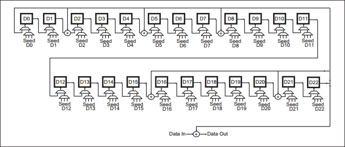
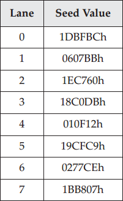
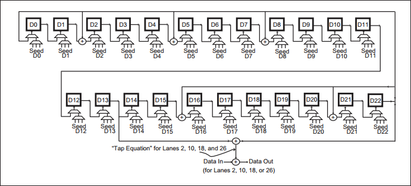
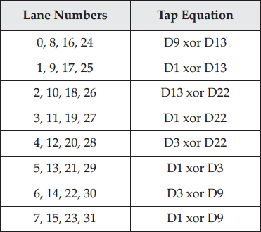
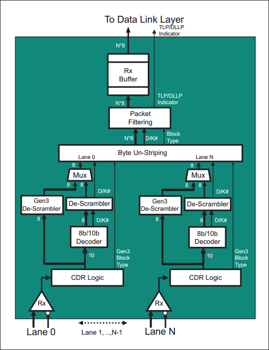
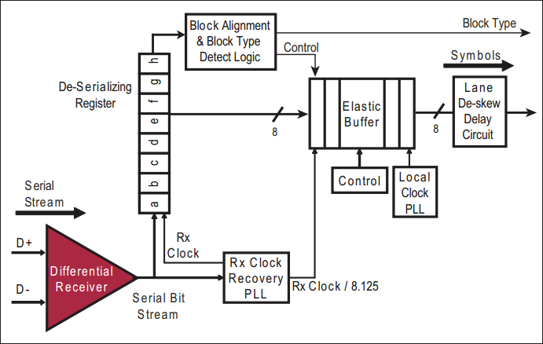
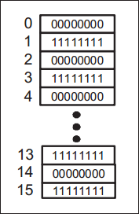
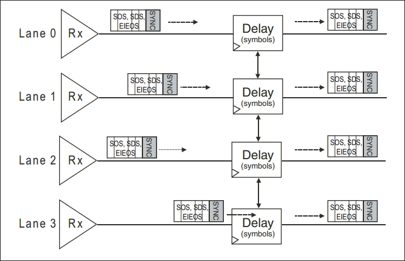
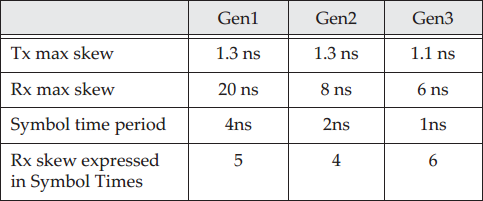

Gen3 在速率未翻倍（5GT/s -> 8GT/s）的情况下，实现了带宽的翻倍（500MB/s -> 984.6MB/s），相比PCIe Gen1、Gen2，Gen3：
- 新的编码模型：采用了更为高效的 128b/130 数据编码，每个时钟周期传输128-bit有效数据。
- 更复杂信号均衡模型：速率提升，Gen1 2.5 GT/s，Gen2 5 GT/s，Gen3 8 GT/s。随着频率提升，需要更强的信号完整性技术，更稳健的信号补偿机制。

# 1. Introduction to Gen3
PCIe 链路进入训练状态时（如复位后），会先以 Gen1 的速度开始，以实现向后兼容。当双方设备能以更高速度时，链路将立即转换至 Recovery 状态，将速率改为链路双方共同支持的最高速度。
PCIe 升级到 Gen3 的主要动机是实现带宽提升一倍。这可以通过信号速率提升一倍（5GT/s -> 10GT/s）实现，但存在如下问题：
- 对于更高频率，功率要求更高，也需要更复杂的均衡逻辑（equalization）来维持更高速率下的信号完整性。实际上， PCISIG 指出，均衡逻辑的高功率需求是维持频率尽可能低的一个重要原因。
- 电路板材的材料和设计要求更高。
- 频率提升越高对基础设施（电路板、连接器等）的要求也会越高，难以使用已有基础设施降低成本。
## 1.1 New Encoding Model
对于 8b/10b 模型，传输 8-bit 有效数据，实际必须传输 10-bit，这样会产生 20% 的传输开销。Gen3 使用 128b/130b 模型，可以极大程度降低传输开销（存在 2/130 的开销）。此时 Gen3 信号速率只需提升到 8GT/s，实际带宽能翻倍提升到 1GB/s。此外，8b/10b 编码中使用控制字符标识数据包边界（如下图所示），接收端通过识别这些控制字符，获取接收的数据类型。

Figure 12-1: 8b/10b Lane Encoding

128/130b 编码将数据包分成一个个包含 16 字节的块（block），每个块开头增加一个 2-bit 的同步字段（Sync Header），用来表示当前块是数据（10b）还是有序集ordered set（01b）。同步字段和有序集必须在所有 lane 上同时传输，链路训练中实现 lane 之间的同步。

Figure 12-2: 128b/130b Block Encoding

## 1.2 Sophisticated Signal Equalization
Gen3 的第二项变化是在物理层的电气模块。Gen1、Gen2 采用预先固定的 Tx 去加重（de-emphasis），以达到良好的信号质量，但速率在 5GT/s 以上时会导致严重的信号完整性问题。Gen3 使用额外的均衡开销，设计在 PHY 的发送端和接收端链路上。

# 2. Encoding for 8.0 GT/s
128b/130b 在整个链路范围封装数据报文，在单个 lane 上对数据分块编码。
## 2.1 Lane-Level Encoding
每个 lane 上的块先是 2-bit 同步头（Sync Header），后面是 16B 的信息，共 130bit。同步头用来标识发送的是数据块（10b）还是有序集（01b）。需要注意的是，链路中先传输的是最低有效位，因此图中同步头是 01（小端），表示数据块 10b（大端）。

Figure 12-3: Sync Header Data Block Example

## 2.2 Block Alignment
与 Gen1、Gen2 一样，接收端首先需要进行位锁定（Bit Lock），然后 Gen3 会进行块锁定（Block Alignment Lock），这需要接收端能从比特流中知晓划分块边界的同步头（仅通过 01h 和 10 h 无法判断第一个块的开始）。发送端通过发送由 00h、FFh 交替组成的 EIEOS 来建立此边界。在 Gen3 中 EIEOS 不仅用于退出电气空闲，而用于建立块对齐机制，同步头会紧随在 EIEOS 前后。
Figure 12-4: Gen3 Mode EIEOS Symbol Pattern

## 2.3 Ordered Set Blocks
与 Gen1、Gen2 一样，Ordered Sets 是用于管理 lane protocol 正常运行（可能涉及同步、握手、较准等），以保证数据在通道上的可靠传输。
当发送有序集块时，它必须同时出现在所有的通道上，并且除了 SOS（SKP 有序集）外都是由 16 bytes 组成。SOS 用于时钟补偿，以 4 bytes 为一组的形式添加/删除 SKP Symbol，其长度可以为 4、8、16、20、24 等。

Figure 12-5: Gen3 x1 Ordered Set Block Example

Ordered Set 块与数据块只是同步头值相反。Gen3 定义了 7 个有序集（比 Gen1/2 多一个 SDS）
- SOS：Skip Ordered Set，用于时钟补偿
- EIOS：Electrical Idle Ordered Set，用于进入电气空闲
- EIEOS：Electrical Idle Exit Ordered Set
   - 退出电气空闲
   - 块对齐边界
- TS1：Training Sequence 1 Ordered Set
- TS2：Training Sequence 2 Ordered Set
- FTS：Fast Training Sequence Ordered Set，用于快速建立退出电气空闲时的位锁定和时钟
- SDS：Start of Data Stream Ordered Set

Figure 12-6: Gen3 FTS Ordered Set Example

上图展示了 Gen3 FTS 有序集的组成，其中 Sync Header 01b 表示当前块为有序集块，并通过块中第一个 Symbol 识别为 FTS 类型，图右侧列出了其他类型有序集第一个 Symbol 值。
## 2.4 Data Stream and Data Blocks
发送端通过发送 SDS 有序集，使链路处于 L0 状态开始传输数据流。数据流以 EDS 标识（Token）结束，其间可以传输多个数据块（除非出现错误）。EDS Token 总是位于有序集前最后一个数据块的后 4 个 Symbol。注意 SKIP 是例外，因为 SKIP 后如果还是数据块意味这数据流没有停止。
## 2.5 Data Block Frame Construction
数据块由 TLPs、DLLP 和 Token 组成，Token 用于标识当前块中类型/状态。在一个数据块中可能会用到五种类型的 Token，下节会介绍。图 12-7 展示了一个单通道 TLP 传输组成的数据块示例。

Figure 12-7: Gen3 x1 Frame Construction Example

### Framing Tokens
共有 5 种 Token（帧标识）：
- STP：表明是 TLP 报文（DW 双字，4B）
- SDP：表明是 DLLP 报文（单字，2B）
- IDL：逻辑空闲（1B），没有 TLPs/DLLPs 传输时，发送 0 字节
- EDS（End of Data Stream）：数据流正常结束（DW，4B）
   - 该 Token 后至少有一个有序集。如果 EDS 后是 SOS + 数据块，不会结束数据流，否则结束。
- EDB：使 TLP 无效数据包（DW，4B）（注意没有 END，当没有 EDB 时默认良好）

数据块的内容因链路当前的活动（activity）而异：
- IDLs：当没有数据包传送时，Data Blocks 只包含 IDL（Token）
- TLPs：根据链路宽度，可以在一个 Data Block 中发送一个或多个 TLP
- DLLP：一个或多个 DLLP 可在 Data Block 中发送
- 以上可以组合在一个 Data Block 中发送

Figure 12-8: Gen3 Frame Token Examples (little-endian)

注意 Spec 中是大端 big-endian
### Packets
以 12-7 图为例，STP/SDP 标识数据包的开始：
- TLPs：STP Token 以全 1 的半字节（nibble）开始。随后是 11-bit 的长度字段（$2^{11} = 2k$双字，8KB TLP），用于对 TLP 双字计数（Token, header, optional data payload, option digest, LCRC），便于接收端识别 TLP 结束位置。Length 字段非常重要，因此有一个检验 length 字段的 4-bit 的 CRC 字段以及检验 length 字段和 CRC 字段的偶数奇偶校验位（Parity bit），两者能检测 3 bit 错。
   - 正常结束的 TLPs 报文没有 END，如果存在损坏会在末尾添加 EDB，作为 TLP 的扩展，Length 字段不会记录。此外损坏 TLP 还会反转 LCRC 值。
- DLLPs：SDP Token 没有长度字段，因为 DLLP 固定 8 bytes：2B Token + 4B payload + 2B LCRC，不需要标识良好结束的 END。
### Transmitter Framing Requirements
数据流从 SDS 之后的第一个 Symbol 开始，它可能包含由 Token、TLPs 和 DLLPs 组成的数据块。数据流以有序集（除 SOS）之前的最后一个 Symbol 结束，或者检测到错误结束。除 SOS 外，数据流期间不能发送任何有序集。

当帧错误发生时，该错误会被接收方视为接收端错误，会向上层报告，同时通过将 LTSSM 从 L0 引导到 Recovery state 启动恢复流程。此时接收端会停止处理当前的数据流，直到检测到 SDS 有序集时开始处理一个新的数据流。
> PCIe 使用一种称为“通道聚合”的技术，其中多条称为“lane”的物理通道同时工作，以增加总线带宽和数据传输速度。数据帧中的信息可以同时通过多条 lane 传输，这样就能够提高总线的传输速度和带宽。每个 lane 负责传输部分数据。

发送一个 TLP：
- STP token 后紧跟 TLP 的全部内容，即使 TLP 数据已无效。
- EDB token 出现在无效 TLP 的最后一个双字中，不包含在 TLP Length 字段计数。
发送一个 DLLP：
- SDP token 后紧跟 DLLP 全部内容
发送 SOS（SKIP Ordered Set）
- 当前数据流（可能被SOS截断）最后一个数据块最后一个双字发送 EDS Token
- SOS 作为下一个有序集
- SOS 之后立即发送新的数据块，数据流恢复。
- SOS 不能连续发送（Gen 1/2 可以），必须间隔 TLP、DLLP or IDL。
结束数据流，需要在数据块最后一个双字发送 EDS token，然后使用 EIOS 进入低功耗状态，或者在所有其他情况下使用 EIEOS。
当链路上没有 TLP、DLLP 或者其他帧令牌时，在所有通道上发送 IDL token。

多 lanes：
- IDL token 后，下一个 TLP/DLLP 必须位于 lane0。
- IDL token 可用于填充 Symbol Time 数据。如 x8 链路在 lane3 结束 TLP，但新的发送数据没准备好，此时使用 IDL 填充后续 lane。
- 数据包以 DW 对齐，即 4 字节，因此数据包可在以 4 对齐的 lane 号开始，前一个 lane 结束。
### Receiver Framing Requirements
当期望帧标识（Framing Token）时，其他任何数据（Symbols）都被认为帧错误（Framing Errors）。
下面所有 error checks 可选，并彼此相互独立。
接收到 STP 时：
- 检查帧的 CRC 和 Parity 奇偶校验字段，有错视为帧错误（Framing Error）
- TLP 最后一个 DW 之后的 Symbols 是下一个要处理的 Token，接收端检查是否是 EDB token，若是标识 TLP 无效。
- Length 字段若为 0 表示帧错误。（可选）
- 同一个 Symbol Time 内若有多个 STP Token 到达视为真错误。（可选）

接收到 EDB 时：
- 检测到第一个 EDB 符号，或者在接收到它的任何剩余字节之后，接收端必须立即通知链路层。
- EDB token 只能出现在 TLP 后，任何其他时间地方视为帧错误
- If any Symbols in the Token are not EDBs, the result is a Framing Error
- EDB 后第一个 Symbol 是下一个需要处理的 Token。

当 EDS Token 作为数据块最后一个 DW 被接收时：
- 接收端停止处理当前数据流
- 之后下一个 Symbol 只能是 SKP, EIOS, or EIEOS Ordered Set，其他 Ordered set 均视为帧错误。
- EDS 后是 SKP Ordered Set，接收端将 EDS 后第一个 Symbol 作为数据块并恢复数据流。

接收到 SDP Token 时：
- DLLP 之后是下一个要处理的 Token

接收到 IDL Token 时：
- IDL token 之后的 token 在任何 DW 对齐 lane 上开始。如 lane0、4、8、12 ...
- 同一 Symbol Time 可接收的是另一个 IDL 或 EDS。

接收端在处理数据流中可能出现的帧错误：
- Ordered Set 紧跟在 SDS 后
- 非法同步头（Sync Header, 11b or 00b）
- 任何 lane 收到有序集时，未在前一个数据块中收到 EDS token
- 正常 EDS 后收到数据块
- 选择验证所有 lane 是否收到相同数据集
### Recovery from Framing Errors

Figure 12-9: AER Correctable Error Register

处理数据流时收到 Framing  Error，接收端需进行如下操作：
- 报告接收端错误（如果可选高级错误报告（Advanced Error Reporting）寄存器可用，则置相应为，如图 12-9 所示）
- 停止处理数据流。当收到 SDS 时再开始处理新的数据流
- 启动错误恢复程序。如果链路处于 L0 状态，还需要转换至恢复状态。spec 规定恢复状态时长少于 1 us。
- 帧错误中恢复不一定会导致数据链路层通过 Ack/Nak 机制启动恢复机制。如果 TLP 由于错误而丢失或损坏，则需要重发。

# 3. Gen3 Physical Layer Transmit Logic

Figure 12-10: Gen3 Physical Layer Transmitter Details

Gen3 发送逻辑整体框架与 Gen2 十分相似，这里只介绍不同的地方，其余未涉及点见上一章相关内容。

## 3.1 Multiplexer
Mux 对上层来的 TLP、DLLP 加入相应 Tokens 构建完整的 TLP、DLLP 数据包。其中 TLP 的结束边界有 STP Token 中 length 字段定义，因此不需要 END frame。

当结束数据流，或者是需要发送 SOS 时，mux 会在数据流中插入 EDS Token。Mux 会定时在数据流中插入 SOS。而在数据流之外，Mux 会根据需要插入其他 Ordered Sets (TS1, TS2, FTS, EIEOS, SDS)。

数据包以块（Blocks）的形式传输，块通过 2-bit 的 Sync Header 标识，该 2-bit 标识由 Mux 添加，在多 lane 链路中会同时复用到所有的 lane 中。

当没有数据包或者有序集传输，且链路处于 L0 状态时，IDL Token（逻辑空闲）会填充至链路中传输。注意 IDL Token 会被加扰并被接收端识别处理。

## 3.2 Byte Striping
字节拆分逻辑（Byte Striping）将 Mux 构建的数据包、Ordered Sets 按照规则（Transmitter Framing Requirements 小节）将各 Symbol 分发到各 lane 中。如图 12-11 所示。

Figure 12-11: Gen3 Byte Striping x4

当 新的 Block 开始时，Sync Header 会同时出现在所有通道上，标识当前块的类型。每个 lane 中块编码独立，但数据包是在整个链路范围封装，派发到各个 lane 中。

### Byte Striping x8 Example

Figure 12-12: Gen x3 Example: TLP Straddles Block Boundary

图 12-12 展示了 8x 链路的数据传输示例。此图与 12-11 不同，本图中比特流垂直绘制，以小端绘制。Sync Header 出现在以 128b 为块的块头，并同时出现在所有 lane 上，标识数据块传输的开始。此图中首先发送 TLP token，其中 Length 字段表明 TLP 整个长度为 7DW。接收端通过 Length 字段计数得到这个 TLP 的结束位置，而不需要再使用 END 控制字符（Gen1、Gen2）作为结束边界。如果没有收到 EDB Token 表明当前 TLP 正常，在 lane3 结束。

接着发送 DLLP 报文。lane4、lane5 中 SDP Token 作为 DLLP 的开始边界，后接 6 Symbol（Byte）信息，注意 DLLP 长度总为 8B。DLLP 之后没有数据发送，因此填充 IDL。在 DLP 之后，再发送 TLP 时只能从 lane 0 开始。

从 TLP Token Length 得知接下来的 TLP 长度为 23DW。当当前数据块（128b）结束，而 Packet 未结束时，下个数据块填充 Sync Header 然后继续发送当前 Packet。

### Nullified Packet x8 Example

Figure 12-13: Gen3 x8 Nullified Packet

图 12-13 展示了 x8 链路中无效数据包的传输示例。当 Switch 使用 Cut-through 模式传输数据时，Switch 在 egress port 接收到数据包并且在错误检查之前将数据包转发到出口端口时，可能会发生无效的 TLP。

在 12-13 图 Lane0 的 Symbol 开始进行一个 TLP 数据包传输。当 Switch egress port 检测到错误是，会反转数据包的 CRC，并在 TLP 最后增加一个 EDB Token，这两个修改告知接收端当前 TLP 无效，应丢弃。
### Ordered Set Example - SOS

Figure 12-14: Gen3 x1 Ordered Set Construction

图 12-14 展示传输一个有序集的基本组成。有序集 Sync Header 为 01b，其后是一个长度为 16B (128b) 的有序集，SOS 例外，因为 SOS 可以由中间接收器一次以 4 个字节为增量进行更改，以进行时钟补偿，其长度可以为 8、12、16B...。在不添加 SKP 的链路中 SOS 也由 16B 组成。

图 12-5 展示了一个 x8 的链路中数据传输示例。成帧规则规定，当 Ordered Set 即将传输时，当前数据流的数据块最后必须以一个双字的 EDS Token 结束。当当前数据流不结束时，当前截断数据流后的 Ordered Sets 只能是 SOS，并且 SOS 后紧跟数据块。

Figure 12-15: Gen3 x8 Skip Ordered Set (SOS) Example

当链路中传输 EDS token 时，表明当前数据流正在结束，或者暂停数据流以站如 SOS。EDS 是唯一可以与 IDL 在同一个 Symbol TIme 中在 DW 对齐 lane 上开始的 Token，如本例中 EDS 从 Symbol Time 15 的 lane4 开始传输。
> EDS 必须位于数据块的最后一个双字处。而且根据规则，EDS 之后只允许有序集块，并且必须是 SOS、EIOS 或 EIEOS，否则视为帧错误。
> Ordered Set 需在所有 lane 上同时传输。

图中传输一个 16B 的 SOS，它以有序集 Sync Header 和 SKP 字节模式组成，此外 SOS 末尾使用有 4 个 Symbol，包含了当前 24 位加扰器 LFSR 的状态。在 Symbol 12（图中为 Symbol 4，可能是书本错误），SKP_END 表明 SKP 结束。下表列出了 16B SKIP Ordered Set  的具体组成。

| Symbol Number | Value | Description |
| --- | --- | --- |
| 0 to 11 | AAh |  SKP Symbol. Since Symbol 0 is the Ordered Set Identifier, this is seen as an SOS. |
| 12 | E1h | SKP_END Symbol, which indicates that the SOS will be complete after 3 more Symbols |
| 13 | 00-FFh | a) If LTSSM state is Polling.Compliance: AAh   b) Else if prior block was a Data Block:   Bit[7] = Data Parity    Bit[6:0] = LFSR [22:16]   c) Else   Bit [7] = ~LFSR [22]   Bit [6:0] = LFSR [22:16] |
| 14 | 00-FFh |  a) If LTSSM state is Polling.Compliance: Error_Status [7:0]   b) Else LFSR [15:8] |
| 15 | 00-FFh |  a) If LTSSM state is Polling.Compliance: Error_Status [7:0]   b) Else LFSR [15:8] |
表中奇偶校验位是对最近 SDS 或 SOS 发送所有数据块加扰字节的偶校验，并且每个 lane 独立创建。接收端需要计算该值，并与接收到的数据进行匹配，如果不匹配需设置对应 lane 的 lane 错误状态（Lane Error Status）寄存器。这不会视为接收端错误，也不会启动链路重新训练。图 12-15 例子中 Symbol 13（图中为 Symbol 5）有 1bit 校验位和 LFSR[22:16] 组成，后续两个字节为 LSFR[15:0]。
>仅当 LTSSM 处于轮询合规状态时，8-bit Error_Status 字段才有意义。

### Transmitter SOS Rules
发送端 SOS（Skip Ordered Set）规则：
- SOS 发生在 370~375 blocks 之间，Loopback 需在此期间调度两个 SOS，彼此间隔不超过 2 blocks。
- SOS 只能在数据包边界发送，可能会累积，但不允许连续发送 SOS，必须使用 Data Block 隔开。
- 发送端处于电气空闲状态时重置 SOS 定时器和计数器。
- 128b/130b 中 Compliance SOS bit（合规性 SOS 位）不起作用，该为用于 8b/10b Compliance test 期间禁用 SOS。
### Receiver SOS Rules
接收端 SOS 规则：
- 需能在 370~370 blocks 平均间隔间接收 SOS。电气空闲后第一个 SOS 会提前发送。
- 需检查数据流中的每个 SOS 前是否是以 EDS Token 结尾的数据块。

## 3.3 Scrambling 
8b/10b 编码主要处理两个问题：
- 保持 DC 平衡，以保证相同数量 1 和 0
- 维持足够多的信号转换，以接收端时钟恢复时比特流能有足够的边沿，实现时钟恢复和时序和相位调整。

128b/130b 编码采用三个步骤解决上述问题：
- 在较长时间内（130b）维持 DC 平衡和转换密度
- 训练期间使用 TS1、TS2 有序集根据需要调整以改进 DC 平衡。
- 接收端鲁棒性更强，能容忍上述问题。

### 3.3.1 Number of LFSRs
Gen1、Gen2 中各 lane 可以用相同的方式加扰，即单个 LFSR 为所有 lane 提供加扰输入。但 Gen3 速率更高，通常希望相邻 lane 具有不同加扰，降低各lane 串扰的可能，如 IDL 时。Spec 给出了两种实现策略：一种注重降低延迟、一种注重降低成本。

Figure 12-16: Gen3 Per-Lane LFSR Scrambling Logic

多个 LFST
- 为每个 lane 实现单独的 LFSR，且具有不同的初始值和随机种子。
- 优点：简单、速度快
- 缺点：增加逻辑
每条 lane 的随机种子会从指定具有 8 个不同值的表分配，如表 12-3 所示，通常按照 0~7 按序分配，超出 8 个从头继续分配。

Table 12-3: Gen3 Scrambler Seed Values

单个 LFSR

Figure 12-17: Gen3 SingleȬLFSR Scrambler

- 针对不同的 lane，使用一个 LFSR，通过将不同的 tap points 异或来为每个 lane 创建加扰。
- 所有 lane 种子值相同，但每个 lane 的加扰方程（Tap Equation）通过不同组合生成
- 每个 lane 还可以通过对相邻的 tap values 异或生成
	- lane 0 = lane 7 XOR lane 1（超过 x8 循环生成）
	- lane 2 = lane 1 XOR lane 3
	- lane 4 = lane 3 XOR lane 5
	- lane 6 = lane 5 XOR lane 7
- 单个 LFSR 能使用更少的 gates，但 XOR 过程会产生额外延迟。

 Table 12-4: Gen3 Tap Equations for SingleȬLFSR Scrambler

### 3.3.2 Scrambling Rules
Gen3 加扰器的 LFSRs 不会不断移位移位寄存器（advance），而是根据正在发送的内容移位。加扰器会定期重置。当检测到 EIEOS 或 FTSOS 时，加扰器会初始化。以下给出几种加扰规则：
- Sync Header 不会加扰，也不会使用 LSFR 移位
- 当发送端发送最后一个 EIEOS Symbol 时，发送端 LFSR 复位；当接收端收到最后一个 EIEOS 时，接收端 LFSR 复位
- TS1、TS2 有序集：
	- Symbol 0 不会被加扰
	- Symbol 1-13 被加扰
	- Symbol 14、15 可能会被加扰。当需要改善 DC 平衡时不会加扰，否则将加扰。
- 有序集 FTS、SDS、EIEOS、EIOS 和 SOS 都不会被加扰。有序集本身会有足够的边缘密度转换实现接收端恢复时钟。
- 旁路（bypassed）时，发送端会将所有有序集 Symbol 移至码流中，SOS 除外。
- 接收端检测传入有序集的 Symbol 0，看它是否是 SOS。若是，LSFRs 不会使能，否则 KSFRs 将作用于 Symbol。
- 所有 DataBlock 被加扰并移入 LFSRs。
- Symbol 按照小端顺序加扰，即最低有效位先加扰，最高有效位后加扰。
- 每个 lane LFSR 的种子值取决于 LTSSM 第一次进入 Configuration.Idle（已完成轮询状态）时分配给该 lane 的 lane 编号。一旦分配，只要 LinkUp = 1，就不会改变，即使 lane 编号因为回到配置状态而被重新分配。
- 128b/130b 编码不能禁用加扰器，需要它帮助实现信号完整性。（8b/10b 可以禁用）
- Loopback Slave 不对回环 Looped-back 位进行加扰或去扰。

## 3.4 Serializer
该移位寄存器 shift register 工作方式与 Gen1/Gen2 的工作方式一致，只是现在一次接收 8-bit 还不是 10-bit。

## 3.5 Mux for Sync Header Bits
最后模块的 Mux 为每个 Block 添加 Sync Header 同步头，使接收端能够区分 Block 是 Data Block 还是 Ordered Set Block。实际上 Sync Header 可以添加到发送端模块中有设计意义中的任何位置，本文加在最后。此外，Sync Header 的添加需要暂停字节流 2bit 时间，以添加 Sync Header。

# 4. Gen3 Physical Layer Receive Logic

Figure 12-18: Gen3 Physical Layer Receiver Details

Gen3 接收逻辑与 Gen1/Gen2 一样，首先从 CDR (Clock and Data Recovery) 电路开始。CDR 中可能会包括锁相环（Phase-Locked Loop, PLL），其根据预期频率和比特流中的电平变化跳变锁定发送端时钟的频率，以产生恢复的时钟（Rx Clock），该 Rx Clock 将锁存输入的数据至串并转换缓冲器中。在建立块对齐后（during the Recovery state of the LTSSM ），Rx Clock 8.125 分频的恢复时钟（Rx Clock/8.125）将 8bit Symbol 锁存到弹性缓冲器（Elastic Buffer）中，之后解扰器从加扰的 Symbol 中恢复出原始数据，绕过 8b/10b 解扰器，直接送到字节拆分（Byte Un-striping）逻辑。最后，Ordered Set 被物理层处理，TLPs/DLLPs 字节流被转发至数据链路层。
> Gen3 理论数据传输速率是 8GT/s，但由于编码方案，实际有效数据会低于这个值，因此 Gen3 内部处理时钟是 Rx Clock / 8.125，8.125 是考虑了提取出 2-bit Sync Header，下节会讲。

本文接下来重点论述 Gen3 改变的部分，对于与 Gen1/Gen2 没有改变的部分不再论述。

## 4.1 Differential Receiver
差分接收器逻辑与 Gen1/Gen2 一样，但进行了电气修改以提高信号完整性（P.468 Signal  Compensation），以及建立信号均衡的训练修改（P.577 Link Eqalization Overview）。#TODO

## 4.2 CDR (Clock and Data Recovery) Logic
### 4.2.1 Rx Clock Recovery
Gen3 的加扰方案有助于时钟恢复，但不能保证短间隔内有良好的转换密度，因此 CDR 逻辑需要在没有那么多电平跳变边沿的情况下保持长时间的同步。spec 中没有给出实现这一目标具体方法，但可能需要更鲁棒的 PLL（Phase-Locked Loop）或者 DLL（Delay-Locked Loop，延迟锁相环）电路。

Figure 12-19: Gen3 CDR Logic

Gen3 弹性缓冲区（Elastic Buffer）内部时钟不是简单的 Rx Clock 时钟的 8 分频，因为 Gen3 输入数据是 2-bit Sync Header 加 16B 的 Block，额外的 2bit 需要在逻辑中处理。spec 没有要求特定实现，其中一个解决方案是将 Rx Clock 除以 8.125，在 130 bit 时间内产生 16 个时钟边缘。

Block Type 检测逻辑需要从比特流中提取出 2-bit Sync Header，因此在 Block 边界，Block Type 检测逻辑将从串并转换器中（deserializer）提取额外 2-bit，确保只有 8bit 数据被传递到弹性缓冲区。

为了解决上述问题，Gen3 8.0GT/s 数据速率内部时钟实际上为 8GHz/8.125 =0.985 GHz。
### 4.2.2 Deserializer（串并转换器）
如图 12-19 所示，接收到的数据通过 Rx 时钟将采样到每条 lane 的串行-并行转换器中。串并转换器将 8-bit 的 Symbol 传至弹性缓冲区（Elastic Buffer），此时时钟是 Rx CLock 的 8.125 分频，以适应 130 比特块中 16 字节数据。

### 4.2.3 Achieving Block Alignment
Figure 12-20: EIEOS Symbol Pattern

在训练期间发送的 EIEOS 用于识别 130-bit Block 的边界。EIEOS 数据模式如图 12-20 所示，其由 00h 和 FFh 的交替 Symbol 组成，当接收端看到这种比特流模式时，最后一个 Symbol 被认为是 Block 边界，并验证接下来 130-bit 数据是否是 Block，若不是继续搜索 EIEOS 特定模式。spec 将这个过程描述为三个阶段：未对齐、对齐和锁定。
- 未对齐（Unaligned Phase）：接收端经过一段时间电气空闲后进入这个阶段，如速率更改为 8.0 GT/s 或从低功耗链路状态退出。在此阶段块对齐模块监视 EIEOS 比特流模式到来，检测到到进入下一阶段。进入下一阶段前还需在接收到 SOS 后，根据 SOS 内容调整块对齐边界。
- 对齐（Aligned Phase）：接收端继续监测 EIEOS，并在发现 EIEOS 时对其位和块对齐进行必要调整。此时由于已经暂时确定了块边界，还需检测 SDS 有序集来确定数据流的开始。当检测到 SDS 时，进行到锁定阶段。如果检测到未定义的 Sync Header（00b、11b），接收器将返回到未对齐阶段。spec 指出，训练期间会发生这种情况，EIEOS 后会紧跟 TS1/TS2。
- 锁定（Locked Phase）：此时接收端不再调整其块对齐边界。此时如果需要重新调整对齐，则可能会丢失一些未对齐数据。如果接收到未定义的 Sync Header，则接收端可以返回到未对齐和对齐阶段。
- 特殊情况：环回（Loopback）。spec 描述了当链路处于环回模式时的情况。环回主设备（Loopback Master）必须能在环回期间调整对齐，并允许发送 EIEOS，以及在 Loopback.Active 状态过程中根据检测到的 EIEOS 调整其接收端。环回从设备（Loopback Slave）必须能在 Loopback.Entry 期间调整对齐，不能在 Loopback.Active 期间调整对齐。当从设备开始回传比特流时，从设备的接收端被认为处于锁定阶段。
### 4.2.4 Block Type Detection
在实现了块对齐之后，接收端将通过传入块的前两位（Sync Header），检测当前块的类型。该类型信息会被同步到物理层其他部分，以确定当前块的处理方式。时钟恢复机制和 Sync Header 检测完成从 130b 到 128b 的转换，该转换必须在物理层完成。

请注意，由于此时每个 lane 的块信息相同，因此可以仅针对一个 lane 实现此逻辑。如果支持不同的链路宽度和 lane 反转，其他 lane 也需要包含这一逻辑。spec 对此对此进行细致规定。

## 4.3 Receiver Clock Compensation Logic
与 Gen1/Gen2 一样，Gen3 通信双方的时钟频率必须在中心频率的 +/-300ppm（百万分之一）范围了，这意味着在最坏情况下每 1666 个时钟，接收方会增/减一个时钟。接收端在弹性缓冲区（Elastic Buffer）完成这部分时钟补偿操作。

Figure 12-21: Gen3 Elastic Buffer Logic

如图 12-21 所示，接收到的 Symbol 使用恢复的 Rx Clock 进入到 Elastic Buffer，并使用接收端本地时钟（Rx 时钟 8.125 分频）从 Elastic Buffer 输出。Elastic Buffer 中与 Gen1/Gen2 一样通过添加或删除 SKP Symbol 来补偿频率差异，但 Gen3 只能一次添加或删除 4 个 SKP Symbol。当 SKP 有序集到达时，监测缓冲器状态的控制逻辑会进行评估：当 Rx Clock 频率高于本地时钟时，在缓冲区接近溢出，将通过删除 4 个 SKP 来补偿溢出情况，以在下一个 SOS 时快速耗尽缓冲区；当 Rx Clock 频率低于本地时钟时，缓冲区接近下溢（空），将通过在 SOS 到达时追加 4 个额外的 SKP 来补偿，以快速填充缓冲区。

Gen3 发送端每 370~375 发送一次 SOS，但只能在数据流边界发送，因此当需要发送 SOS 时处于数据流状态，将累计到下一个数据包边界发送。此外，与 Gen1/Gen2 不同的是，Gen3 不允许连续发送 SOS，必须由数据块隔离，因此接收端必须能够承受设备支持最大数据包有效载荷大小分隔的 SOS。

时钟补偿调整仅以 4 个 Symbol 为增量进行可能会影响弹性缓冲区深度，因为在应用任何补偿之前需要有 4 个 Symbol 的差异，而在发送端需要发送 SOS 进行时钟补偿时可能正在发送一个大数据包，此时需要接收端对时钟差异造成的数据差异有足够的容忍，因此需要谨慎确定缓冲区的最佳大小。

例如，发送端需要在 370~375 Block 发送一次 SOS，而正好在 375 Blocks 时需要发送一个大数据包，由于 SOS 不能中断数据包，因此这个 SOS 会累积。375 Blocks 会有 6000 个 Symbol，将其除以 1666（spec 允许的时钟频率差异） ，意味着此时发/收双方存在 3.6 个时钟差异。如果当前 TLP 大数据包是 4KB，对于 x1 链路来说，它的 SOS 总延时将是 6000 + 4096 = 10096 个 Symbol Time，即 10096/1666 = 6.06 个时钟。因此此时缓冲区大小必须被设计为能容忍 7 个 Symbol。此外，还需考虑 Gen1/Gen2 能够连续发送 SOS，而 Gen3 不能连续发送，意味着当需要发送这个 SOS 时，可能有累积的 SOS 也要发送。

## 4.4 Lane-to-Lane Skew
### 4.4.1 Flightt Time Variancce Between Lanes

Figure 12-22: Receiver Link De-Skew Logic

多 lane 链路中，lane 之间数据传输时间差异，将在接收端通过延迟较早到达的 lane 上的数据，直接所有的 lane 全部达到，来自动纠正。 spec 允许设计者通过任何方式来实现这一点。但在 Elastic Buffer 之后，使用数字延迟逻辑来实现去偏移有一个好处，即到达时间差异此时已经被采样为接收端的本地 Symbol Time。如果在某个时钟边沿，一个 lane 的数据到达，而另一个 lane 没有，则它们之间的差异可以用若干时钟周期来衡量，此时早到的lane 可以延迟适当数量的时钟周期，使其与其他 lane 保持一致。实际上接收端容忍的最大偏差是时钟周期的倍数。下表显示了 Gen 1/2/3 允许的偏差。

### 4.4.2 De-skew Opportunities
对于去偏移（de-skew），必须是所有 lane 上同时传输相同的数据才能执行，因此需要在有序集时执行。然而，去偏仅在 L0s、Recovery、Configuration LTSSM 状态下执行。它必须作为以下状态转移的必要条件：
- 离开 Configuration.Complete
- 在离开 Configuration.Idle 或 Recovery.Idle，开始处理数据流时
- 离开 Recovery.RcvrCfg
- 离开 Rx_L0s.FTS
如果偏移在 L0 期间发生变化（如温度、电压等），则可能会使接收端发生错误并导致重发数据。如果偏移一直存在，链路会转换到恢复状态，执行偏移校正。虽然设备在 L0 状态不能进行 lane 的偏移校正，但在此状态下定期发送的 SOS 包含一个 LFSR 值，其能帮助外部工具完成这一工作。这些工具不受数据流规则的约束，可以搜索 SOS，并使用其数据模式来实现数据流中的位锁定、块对齐和通道去偏移。
> spec notes: 当发送端退出 L0s 时，将发送一个 EIEOS，然后是正确数量的 FTS，并在每 32 个 FTS 后插入另一个 EIEOS，再发送最后的 EIEOS 以协助块对齐，最后是 SDS 启动数据流和去偏移。

### 4.4.3 Receiver Lane-to-Lane De-skew Capability
发送端只允许存在极小偏移，以便

## 4.5 Descambler
## 4.6 Byte Un-Striping
## 4.7 Packet Filtering
## 4.8 Receive Buffer (Rx Buffer)

# 5. Notes Regarding Loopback with 128b/130b
