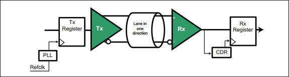

Chapter 12 描述了 Gen3 逻辑物理层特性。相比 Gen2，Gen3 在频率没有翻倍的情况下，实现带宽翻倍，这主要通过使用 128b/130 替代 8b/10b 编码来实现。此外，更高的速度需要更强的信号补偿机制。 
下一章 Chapter 14 讲述物理层链路训练和状态机（LTSSM）的操作。

# 1. Backward Compatibitity
Spec 规定物理层电气部分需要向下兼容，即更高的速率需要兼容低速率。基本要求：
- 所有设备初始训练以 2.5 GT/s Gen1 速度完成
- 更改速率需要链路双方协商，以确定双方共同支持的最高速率。
- 支持高速率 Root ports 需要同时支持低速率 Gen1、Gen2
	- Root ports：PCIe 总线起始点，链接 CPU/北桥
- 下游设备必须支持 Gen1 速率，中间速率可选。即下游 Gen3 设备需支持 Gen1、Gen3 速率，Gen2 速率可不支持。
>无论速率如何，可选的参考时钟（Refclk）都保持不变，并且不需要改动抖动特性（jitter characteristics）来支持更高的速率。

Gen3 提升至 8.0GT/s 做的一些变化：
- ESD standards（静电放电）：Gen3 与 Gen1/Gen2 版本一样，要求所有信号和电源引脚能承受一定水平的静电放电（Electro-Static Discharge, ESD）。但 Gen3 需要满足更多的 JEDEC 标准，并且 SPEC 指出该标准适用于设备，无论它们支持哪种速率。
- Rx powered-off Resistance（断点电阻）：Gen3 指定了新的阻抗值（ $Z_{RX-HIGH-IMP-DC-POS}$  和 $Z_{RX-HIGH-IMP-DC-NEG}$ ），该阻抗值同时也应用于 Gen1、Gen2。
- Tx Equalization Tolerance（均衡容差）：将 Tx 去加重值的先前规格容差从 +/-0.5dB 放宽至 +/-1.0dB，使得 -3.5、-6.0dB 去加重容差在 Gen1/2/3 上保持一致。
- Tx Equalization during Tx Margining：在早期规范中，这种情况去加重容差已放宽至 +/-1.0dB。Gen3 的精度由发送端的 Tx 系数粒度（Tx coefficient granularity）和 TxEQ 容差决定。
- $V_{TX-ACCM}$ 和 $V_{RX-ACCM}$ ：对于 Gen1、Gen2，发送端放宽至 150 mVPP，接收端放宽至 300 mVPP。
> ACCM：AC Common-Mode Voltage，用于数据传输的交流信号的共模电压。
> mVPP：Voltage Pead-Peak，指信号波形中正峰值和负峰值之间的差异。150mVPP 表示信号在正负方向上的振幅差异为 150 毫伏（mV）。

# 2. Component Interfaces
来自不同供应商的组件必须可靠地协同工作，因此借口必须满足一些规定。Gen1 的接口是隐式规定的，Gen2 接口显示规定了需要满足的参数。其他接口可能在连接器或其他位置指定，它们没有包含在基本规范中，而是会在其他规格中描述，如 PCI Express Card Electrimechanical Spec。

# 3. Physical Layer Electrical Overview

Figure 13-1: Electrical Sub-Block of the Physical Layer

每个 lane 的电气子模块提供了链路的物理接口，其包含差分发送器和接收器。发送器通过将比特流转换为两个具有相反极性的单端电信号来在每个 lane 上传送 Symbols。接收端比较两个信号，当差异足够正或负时，生成一个 1 或 0，以将预期发送的串行比特流重新发送到物理层其他部分。

当链路处于 L0 full-on 状态时，驱动器会施加与逻辑 1 和逻辑 0 相关的差分电压，同时保持正确的直流共模电压（DC common mode voltage）。接收端将此电压视为输入流，如果它降到阈值以下时，则可以理解为表示电气空闲链路状态。链路禁用、ASPM 逻辑将链路置于低功耗状态（L0s、L1）时，就会进入到链路空闲状态。

设备必须支持所支持速率所需的发送端均衡方法（Transmitter equalization），实现足够的信号完整性。Gen1、Gen2 采用去加重，Gen3 采用更复杂的均衡策略。后续会有讲到。（#TODO）

驱动器和接收端具有短路同错能力，使 PCIe add-in Cards 适用于热插拔连接两个组件的链路通过在线路中添加电容器（通常靠近链路发送端侧，$C_{TX}$）进行交流耦合（AC-coupled），以将链路组件之间的直流信号部分去耦，意味着它们不必像通过电缆连接的设备那样共用一个电源或接地。
> $C_{TX}$：用于将交流信号传至另一电路或电子元件，同时阻隔直流信号，有助于隔离不同电路部分，确保不会相互干扰。
> AC 耦合中，电容器允许交流信号通过，因为交流信号会在两个电极之间产生变化电压，而电容器会充电放电，从而传递交流信号。直流信号没有变化电压，无法通过电容器。

# 4. High Speed Signaling

Figure 13-2: Differential Transmitter Receiver

>（笔者注：解释可能不正确）
>$V_{TX-CM} = 0-3.6 V$ ，发送端共模电压，也就是差分信号共同模式电压。共模电压是指两个信号线之间的平均电压，对于差分信号传输非常重要，其稳定性能影响整体信号质量和抗干扰能力。
>$Z_{TX}$，发送端特性阻抗，也就是发送信号的输出端的阻抗。PCIe 规范中要求发送器的输出阻抗应该匹配特定的值，以确保信号的准确传输，并最小化反射和失真。

PCIe Gen3 信号传输架构特点如图 13-2 所示。这种低压差分信号架构是许多串行传输中的常用方法，原因之一是它能有效抑制噪声。因为两根信号线走线非常接近，且位于相邻引脚上，影响其中一个信号的电噪声也会影响到另外一个。由于两个信号都会收到影响，因此它们之间的差异不会发生太大。如图 13-3 所示。

Figure 13-3: Differential Common-Mode Noise Rejection

>3.0 SPEC的设计目标是使 Gen3 仍适用于现有标准 FR4 电路板和连接器，通过改进编码方式以保持较低频率，Gen4 后会有大的改变。
>R4 是一种常见的玻璃纤维增强的复合材料，用于制造电路板（PCB，Printed Circuit Board）。这种材料以其优良的电气性能、机械强度和耐热性而闻名。

# 5. Clock Requrements
## 5.1 General
对于所有数据速率，发送端和接收端时钟都必须精确到中心频率的 +/-300（百万分之一）以内。在最坏情况下，发送端和接收端可能相差 600ppm，意味着每 1666 （1 million/600）个时钟将多/少 1 个时钟，接收端时钟补偿逻辑需要考虑这种差异。

设备可以从外部获得时钟，并且在 3.0 SPEC 中仍然可以使用 100 MHz Refclk 来实现此目的。即使在应用扩频（Spread Spectrum Clocking）时，使用 Refclk 也能让链路双方保持 600ppm 的精度。

## 5.2 SSC (Spread Spectrum Clocking)
SSC 是一种可选技术，用于在规定范围内缓慢调制时钟频率，以将信号的 EMI（电磁干扰）分散到整个频率范围，而不是集中在某个频率。传播辐射能量有助于设备或系统保持在某个阈值以内，以符合标准。

Figure 13-4: SSC Motivation

需要注意的是，信号相关的频率仅为时钟频率的一半，因为需要两个时钟上升沿来创建一个数据周期，如图 13-5 所示。举个例子，如果一个数据传输速率是 2.5GT/s，那么比特时钟（bit clock）频率是 2.5 GHz，但实际上对信号采样时只关注信号变化的频率，而不是时钟的频率，实际关注的信号频率是时钟频率的一半，也就是说关注的信号轨迹上的频率是 1.25 GHz，这个 1.25 GHz 才是实际数据变化的频率，也是实际传输信号的频率，因为每个数据周期需要两个时钟边缘。

Figure 13-5: Signal Rate Less Than Half the Clock Rate

>在 PCIe 中，信号的相关频率是指数据传输中信号变化的频率。通常情况下，PCIe 信号的相关频率是时钟频率的一半。这涉及到数据的传输和时钟信号之间的关系。
>PCIe 中数据信号的变化通常是在时钟信号的边沿上进行的，即在时钟信号的上升沿或下降沿上进行数据传输。PCIe规范要求在每个时钟周期内，在时钟的上升沿和下降沿之间传输一个数据位（或多个数据位），这意味着在两个连续的时钟边沿之间会有一个数据周期。
>因此，信号相关频率为时钟频率的一半，是因为在数据传输中，信号变化发生在时钟的边沿上，每个时钟周期内有一个数据周期。这种设置使得在给定的时钟频率下，能够在受限的时间内有效地传输数据。

Figure 13-6: SSC Modulation Example

SPEC 不要求使用 SSC，但如果支持SSC，需要适用以下规则：
- 时钟可以在额定值（5000ppm）的基础上进行 +0% 至 -0.5% 的调制，称为“向下扩展”。虽然没有指定频率调制包络线，但类似于图 13-6 所示的锯齿波模式效果很好。需要注意的是，向下扩展需要权衡利弊，因为此时平均时钟频率将比不使用 SSC 时低 0.25%，从而导致性能略有下降。
	- 包络线：将一段时间长度的高频信号的峰值点连线，就可以得到上方（正的）一条线和下方（负的）一条线，这两条线就叫包络线。 包络线就是反映高频信号幅度变化的曲线。
- 调制速率必须在 30KHz 到 33 KHz 之间
- 时钟频率精度仍适用于 +/- 300ppm。SPEC 规定大部分链路双方使用相同时钟源，如可都使用调制版 Refclk 来获得各自时钟。
## 5.3 Refclk Overview
接收端需要生成自己的时钟来运行内部逻辑，但也可以从输入比特流生成恢复时钟，其详细信息随着版本、速率的提升而指定。
### 5.3.1 2.5 GT/s
Gen1 Refclk 信息未包含在 SPEC 中，而是包含在 PCIe 单独的 CEM（Card Electro-Mechanical） 规范中，其中规定了一些参数。Refclk 被描述为驱动 100Ω（+/- 10%）差分负载的 100 MHz 差分时钟，其走线长度限制为 4 英寸，并允许 SSC。
### 5.3.2 5.0 GT/s
从 Gen2 开始，SPEC 将 Refclk 信息包含在物理层电气部分，并列出了三种时钟架构：Common Refclk、Data Clocked Rx Architecture、Separate Refclks。
**Common Refclk.**

Figure 13-7: Shared Refclk Architecture

链路双方使用相同的 Rcfclk，该实现方式具有三个优点：
- 与参考时钟相关的抖动同时作用于 Rx、Tx，因此可以从本质上进行跟踪和计算
- SSC 实现最简单，因为 Tx、Rx 时钟遵循相同的调制参考时钟，很容易保持 600ppm
- 低功率链路状态 L0s、L1 期间，Refclk 仍可用，这使得接收端得 CDR 即使没有比特流提供数据边沿的情况下，也能保持恢复时钟，这也会使本地 PLL 不会像其他方式那样发生漂移，从而缩短恢复到 L0 的时间。

**Data Clocked Rx Architecture.**

Figure 13-8: Data Clocked Rx Architecture

如上图所示，这种时钟结构中，接收端不适用参考时钟，而是从数据流中恢复发送端时钟。这种方式最为简单，也通常被优先采用。SPEC 没有禁止在此模式中使用 SSC，但使用 SSC 会存在两个问题：
- 接收端 CDR 必须在更大的调试范围（5600ppm，而不是 600ppm）内保持对输入频率的锁定，这需要更复杂的逻辑。
- 必须仍然保持 600ppm 的最大时钟间隔，而且在没有共同基准的情况下，如何做到这点 SPEC 中没有说明。

**Separate Refclks.**

Figure 13-9: Separate Refclk Architecture

链路双方可以使用不同的参考时钟，但是这种实现方式对参考时钟要求大大提高，因为接收端看到的抖动将是两者的 RSS（平方根）的结合，从而使时间预算变得困难，此时管理 SSC 也会更加困难。这种实现方式下，SPEC 规定必须关闭 SSC。该方案通常不用。
### 5.3.3 8.0 GT/s
Gen3 下SPEC 中同样讲述了与 Gen2 相同的时钟框架。不同之处在于 Gen3 定义了两种 CDR：共享 Refclk 架构的一阶 CDR 和数据时钟架构的二阶 CDR。与较低速率的情况一样，数据时钟架构的 CDR 需要更加复杂，以在 SSC 的基准变化范围较大时保持锁定。

# 6. Transmitter (Tx) Specs
## 6.1 Measuring Tx Signals
在 Gen1 2.5GT/s 时，可以将测试探头放置在非常靠近 DUT（Device Under Test）引脚的位置，但对于更高速率，需要使用带有 SMA（SubMiniature version A）微波同轴连接器的“分路通道”（breakout channel），如图 13-10 中 TP1（Test Point 1）、TP2 和 TP3 所示。需要注意的是，有必要为被测设备提供低抖动时钟源，这样输出端看到的抖动才是由设备本身引起的。SPEC 还指出，测试过程中，设备必须同时使用尽可能多的通道和其他输出，以模拟真实系统。

Figure 13-10: Test Circuit Measurement Channels

由于分路通道（breakout channel）会对信号产生一些影响，对于 Gen3 来说，需要能够测量到这种影响，并将其从被测信号中去除。可以在测试板上提供另一条与设备引脚非常相似的信号路径，使用已知信号对这一“复制通道”进行特性分析，获得有关通道的必要信息，从而将其影响从 DUT 信号中去除，以恢复元件引脚处的信号。
## 6.2 Tx Impedance Requirements
为了获得最佳精度，Breakout Channel 的特性差分阻抗应为 100 Ω，10% 以内，单端阻抗为 50 Ω。为匹配这种环境，发送端在 Gen1 2.5 GT/s 信号传输期间的差分低阻抗值为 80~120Ω，Gen2/Gen3 不超过 120Ω。对于接收端，Gen1/Gen2 时单端阻抗为 40~60Ω，对于 Gen3 没有给出具体数值，只是指出在进入监测 LTSSM 状态时，单端接收器阻抗必须在 20% 以内，这样检测电路才能正确感测接收器。

发送差分信号时，发送端还必须满足回波损耗参数（return loss parameters）$RL_{TX-DIFF}$、$RL_{TX-CM}$ 。
> 回波损耗是对通过传输路径传输或从传输路径反射回来的能量的度量，是用于分析高频信号环境的几个“散射（Scattering）”参数之一。

当频率较低时，lumped-element（集总元件）描述足够，但当频率足够高，波长接近电路尺寸时，需要分布式模型，使用 S-parameters 来表示。
当信号未被驱动时（如低功耗链路状态），发送端可能会进入高阻抗状态以减少功耗。对于这种情况，只需要满足 $I_{TX-SHORT}$ 值，并且未定义差分阻抗。
## 6.3 ESD and Short Circuit Requirements
所有信号和电源必须能够承受使用人体模型的 2000V ESD（静电放电）和使用充电设备模型的 500V 的电压。更多详细描述需参阅 JEDEC JESE22-A114-A spec。 ESD 要求不仅可以防静电，还能助于支持意外的热插拔。该目标要求发送端和接收端能够承受 $I_{TX-SHORT}$ 的持续短路电流，后续会介绍。（#TODO）
## 6.4 Receiver Detection

Figure 13-11: Receiver Detection Mechanism

上图所示的发送端中检测模块用于检查复位后链路的另一端是否存在接收端。这一步骤在串行传输中很少使用，因为链路双方可以通过发送数据包是否相应来测试对方是否存在。在 PCIe 中采用这种方式是为了在测试环境中提供自动硬件辅助

## 6.5 Transmitter Voltages

# 7. Receiver (Rx) Specs
# 8. Signal Compensation
# 9. Eye Diagram
# 10. Transmitter Driver Characteristics
# 11. Receiver Characteristics
# 12. Link Power Management States