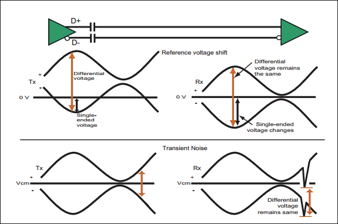
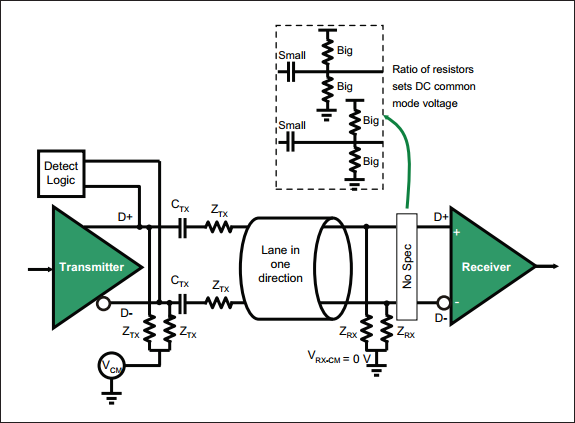

Chapter 12 描述了 Gen3 逻辑物理层特性。相比 Gen2，Gen3 在频率没有翻倍的情况下，实现带宽翻倍，这主要通过使用 128b/130 替代 8b/10b 编码来实现。此外，更高的速度需要更强的信号补偿机制。 
下一章 Chapter 14 讲述物理层链路训练和状态机（LTSSM）的操作。

# 1. Backward Compatibitity
Spec 规定物理层电气部分需要向下兼容，即更高的速率需要兼容低速率。基本要求：
- 所有设备初始训练以 2.5 GT/s Gen1 速度完成
- 更改速率需要链路双方协商，以确定双方共同支持的最高速率。
- 支持高速率 Root ports 需要同时支持低速率 Gen1、Gen2
	- Root ports：PCIe 总线起始点，链接 CPU/北桥
- 下游设备必须支持 Gen1 速率，中间速率可选。即下游 Gen3 设备需支持 Gen1、Gen3 速率，Gen2 速率可不支持。
>无论速率如何，可选的参考时钟（Refclk）都保持不变，并且不需要改动抖动特性（jitter characteristics）来支持更高的速率。

Gen3 提升至 8.0GT/s 做的一些变化：
- ESD standards（静电放电）：Gen3 与 Gen1/Gen2 版本一样，要求所有信号和电源引脚能承受一定水平的静电放电（Electro-Static Discharge, ESD）。但 Gen3 需要满足更多的 JEDEC 标准，并且 SPEC 指出该标准适用于设备，无论它们支持哪种速率。
- Rx powered-off Resistance（断点电阻）：Gen3 指定了新的阻抗值（ $Z_{RX-HIGH-IMP-DC-POS}$  和 $Z_{RX-HIGH-IMP-DC-NEG}$ ），该阻抗值同时也应用于 Gen1、Gen2。
- Tx Equalization Tolerance（均衡容差）：将 Tx 去加重值的先前规格容差从 +/-0.5dB 放宽至 +/-1.0dB，使得 -3.5、-6.0dB 去加重容差在 Gen1/2/3 上保持一致。
- Tx Equalization during Tx Margining：在早期规范中，这种情况去加重容差已放宽至 +/-1.0dB。Gen3 的精度由发送端的 Tx 系数粒度（Tx coefficient granularity）和 TxEQ 容差决定。
- $V_{TX-ACCM}$ 和 $V_{RX-ACCM}$ ：对于 Gen1、Gen2，发送端放宽至 150 mVPP，接收端放宽至 300 mVPP。
> ACCM：AC Common-Mode Voltage，用于数据传输的交流信号的共模电压。
> mVPP：Voltage Pead-Peak，指信号波形中正峰值和负峰值之间的差异。150mVPP 表示信号在正负方向上的振幅差异为 150 毫伏（mV）。

# 2. Component Interfaces
来自不同供应商的组件必须可靠地协同工作，因此借口必须满足一些规定。Gen1 的接口是隐式规定的，Gen2 接口显示规定了需要满足的参数。其他接口可能在连接器或其他位置指定，它们没有包含在基本规范中，而是会在其他规格中描述，如 PCI Express Card Electrimechanical Spec。

# 3. Physical Layer Electrical Overview

Figure 13-1: Electrical Sub-Block of the Physical Layer

每个 lane 的电气子模块提供了链路的物理接口，其包含差分发送器和接收器。发送器通过将比特流转换为两个具有相反极性的单端电信号来在每个 lane 上传送 Symbols。接收端比较两个信号，当差异足够正或负时，生成一个 1 或 0，以将预期发送的串行比特流重新发送到物理层其他部分。

当链路处于 L0 full-on 状态时，驱动器会施加与逻辑 1 和逻辑 0 相关的差分电压，同时保持正确的直流共模电压（DC common mode voltage）。接收端将此电压视为输入流，如果它降到阈值以下时，则可以理解为表示电气空闲链路状态。链路禁用、ASPM 逻辑将链路置于低功耗状态（L0s、L1）时，就会进入到链路空闲状态。

设备必须支持所支持速率所需的发送端均衡方法（Transmitter equalization），实现足够的信号完整性。Gen1、Gen2 采用去加重，Gen3 采用更复杂的均衡策略。后续会有讲到。（#TODO）

驱动器和接收端具有短路同错能力，使 PCIe add-in Cards 适用于热插拔连接两个组件的链路通过在线路中添加电容器（通常靠近链路发送端侧，$C_{TX}$）进行交流耦合（AC-coupled），以将链路组件之间的直流信号部分去耦，意味着它们不必像通过电缆连接的设备那样共用一个电源或接地。
> $C_{TX}$：用于将交流信号传至另一电路或电子元件，同时阻隔直流信号，有助于隔离不同电路部分，确保不会相互干扰。
> AC 耦合中，电容器允许交流信号通过，因为交流信号会在两个电极之间产生变化电压，而电容器会充电放电，从而传递交流信号。直流信号没有变化电压，无法通过电容器。

# 4. High Speed Signaling

Figure 13-2: Differential Transmitter Receiver

>（笔者注：解释可能不正确）
>$V_{TX-CM} = 0-3.6 V$ ，发送端共模电压，也就是差分信号共同模式电压。共模电压是指两个信号线之间的平均电压，对于差分信号传输非常重要，其稳定性能影响整体信号质量和抗干扰能力。
>$Z_{TX}$，发送端特性阻抗，也就是发送信号的输出端的阻抗。PCIe 规范中要求发送器的输出阻抗应该匹配特定的值，以确保信号的准确传输，并最小化反射和失真。

PCIe Gen3 信号传输架构特点如图 13-2 所示。这种低压差分信号架构是许多串行传输中的常用方法，原因之一是它能有效抑制噪声。因为两根信号线走线非常接近，且位于相邻引脚上，影响其中一个信号的电噪声也会影响到另外一个。由于两个信号都会收到影响，因此它们之间的差异不会发生太大。如图 13-3 所示。

Figure 13-3: Differential Common-Mode Noise Rejection

>3.0 SPEC的设计目标是使 Gen3 仍适用于现有标准 FR4 电路板和连接器，通过改进编码方式以保持较低频率，Gen4 后会有大的改变。
>R4 是一种常见的玻璃纤维增强的复合材料，用于制造电路板（PCB，Printed Circuit Board）。这种材料以其优良的电气性能、机械强度和耐热性而闻名。

# 5. Clock Requrements
## 5.1 General
对于所有数据速率，发送端和接收端时钟都必须精确到中心频率的 +/-300（百万分之一）以内。在最坏情况下，发送端和接收端可能相差 600ppm，意味着每 1666 （1 million/600）个时钟将多/少 1 个时钟，接收端时钟补偿逻辑需要考虑这种差异。

设备可以从外部获得时钟，并且在 3.0 SPEC 中仍然可以使用 100 MHz Refclk 来实现此目的。即使在应用扩频（Spread Spectrum Clocking）时，使用 Refclk 也能让链路双方保持 600ppm 的精度。

## 5.2 SSC (Spread Spectrum Clocking)
SSC 是一种可选技术，用于在规定范围内缓慢调制时钟频率，以将信号的 EMI（电磁干扰）分散到整个频率范围，而不是集中在某个频率。传播辐射能量有助于设备或系统保持在某个阈值以内，以符合标准。

Figure 13-4: SSC Motivation

需要注意的是，信号相关的频率仅为时钟频率的一半，因为需要两个时钟上升沿来创建一个数据周期，如图 13-5 所示。举个例子，如果一个数据传输速率是 2.5GT/s，那么比特时钟（bit clock）频率是 2.5 GHz，但实际上对信号采样时只关注信号变化的频率，而不是时钟的频率，实际关注的信号频率是时钟频率的一半，也就是说关注的信号轨迹上的频率是 1.25 GHz，这个 1.25 GHz 才是实际数据变化的频率，也是实际传输信号的频率，因为每个数据周期需要两个时钟边缘。

Figure 13-5: Signal Rate Less Than Half the Clock Rate

>在 PCIe 中，信号的相关频率是指数据传输中信号变化的频率。通常情况下，PCIe 信号的相关频率是时钟频率的一半。这涉及到数据的传输和时钟信号之间的关系。
>PCIe 中数据信号的变化通常是在时钟信号的边沿上进行的，即在时钟信号的上升沿或下降沿上进行数据传输。PCIe规范要求在每个时钟周期内，在时钟的上升沿和下降沿之间传输一个数据位（或多个数据位），这意味着在两个连续的时钟边沿之间会有一个数据周期。
>因此，信号相关频率为时钟频率的一半，是因为在数据传输中，信号变化发生在时钟的边沿上，每个时钟周期内有一个数据周期。这种设置使得在给定的时钟频率下，能够在受限的时间内有效地传输数据。

Figure 13-6: SSC Modulation Example

SPEC 不要求使用 SSC，但如果支持SSC，需要适用以下规则：
- 时钟可以在额定值（5000ppm）的基础上进行 +0% 至 -0.5% 的调制，称为“向下扩展”。虽然没有指定频率调制包络线，但类似于图 13-6 所示的锯齿波模式效果很好。需要注意的是，向下扩展需要权衡利弊，因为此时平均时钟频率将比不使用 SSC 时低 0.25%，从而导致性能略有下降。
	- 包络线：将一段时间长度的高频信号的峰值点连线，就可以得到上方（正的）一条线和下方（负的）一条线，这两条线就叫包络线。 包络线就是反映高频信号幅度变化的曲线。
- 调制速率必须在 30KHz 到 33 KHz 之间
- 时钟频率精度仍适用于 +/- 300ppm。SPEC 规定大部分链路双方使用相同时钟源，如可都使用调制版 Refclk 来获得各自时钟。
## 5.3 Refclk Overview
接收端需要生成自己的时钟来运行内部逻辑，但也可以从输入比特流生成恢复时钟，其详细信息随着版本、速率的提升而指定。
### 5.3.1 2.5 GT/s
Gen1 Refclk 信息未包含在 SPEC 中，而是包含在 PCIe 单独的 CEM（Card Electro-Mechanical） 规范中，其中规定了一些参数。Refclk 被描述为驱动 100Ω（+/- 10%）差分负载的 100 MHz 差分时钟，其走线长度限制为 4 英寸，并允许 SSC。
### 5.3.2 5.0 GT/s
从 Gen2 开始，SPEC 将 Refclk 信息包含在物理层电气部分，并列出了三种时钟架构：Common Refclk、Data Clocked Rx Architecture、Separate Refclks。
**Common Refclk.**

Figure 13-7: Shared Refclk Architecture

链路双方使用相同的 Rcfclk，该实现方式具有三个优点：
- 与参考时钟相关的抖动同时作用于 Rx、Tx，因此可以从本质上进行跟踪和计算
- SSC 实现最简单，因为 Tx、Rx 时钟遵循相同的调制参考时钟，很容易保持 600ppm
- 低功率链路状态 L0s、L1 期间，Refclk 仍可用，这使得接收端得 CDR 即使没有比特流提供数据边沿的情况下，也能保持恢复时钟，这也会使本地 PLL 不会像其他方式那样发生漂移，从而缩短恢复到 L0 的时间。

**Data Clocked Rx Architecture.**

Figure 13-8: Data Clocked Rx Architecture

如上图所示，这种时钟结构中，接收端不适用参考时钟，而是从数据流中恢复发送端时钟。这种方式最为简单，也通常被优先采用。SPEC 没有禁止在此模式中使用 SSC，但使用 SSC 会存在两个问题：
- 接收端 CDR 必须在更大的调试范围（5600ppm，而不是 600ppm）内保持对输入频率的锁定，这需要更复杂的逻辑。
- 必须仍然保持 600ppm 的最大时钟间隔，而且在没有共同基准的情况下，如何做到这点 SPEC 中没有说明。

**Separate Refclks.**

Figure 13-9: Separate Refclk Architecture

链路双方可以使用不同的参考时钟，但是这种实现方式对参考时钟要求大大提高，因为接收端看到的抖动将是两者的 RSS（平方根）的结合，从而使时间预算变得困难，此时管理 SSC 也会更加困难。这种实现方式下，SPEC 规定必须关闭 SSC。该方案通常不用。
### 5.3.3 8.0 GT/s
Gen3 下SPEC 中同样讲述了与 Gen2 相同的时钟框架。不同之处在于 Gen3 定义了两种 CDR：共享 Refclk 架构的一阶 CDR 和数据时钟架构的二阶 CDR。与较低速率的情况一样，数据时钟架构的 CDR 需要更加复杂，以在 SSC 的基准变化范围较大时保持锁定。

# 6. Transmitter (Tx) Specs
## 6.1 Measuring Tx Signals
在 Gen1 2.5GT/s 时，可以将测试探头放置在非常靠近 DUT（Device Under Test）引脚的位置，但对于更高速率，需要使用带有 SMA（SubMiniature version A）微波同轴连接器的“分路通道”（breakout channel），如图 13-10 中 TP1（Test Point 1）、TP2 和 TP3 所示。需要注意的是，有必要为被测设备提供低抖动时钟源，这样输出端看到的抖动才是由设备本身引起的。SPEC 还指出，测试过程中，设备必须同时使用尽可能多的通道和其他输出，以模拟真实系统。

Figure 13-10: Test Circuit Measurement Channels

由于分路通道（breakout channel）会对信号产生一些影响，对于 Gen3 来说，需要能够测量到这种影响，并将其从被测信号中去除。可以在测试板上提供另一条与设备引脚非常相似的信号路径，使用已知信号对这一“复制通道”进行特性分析，获得有关通道的必要信息，从而将其影响从 DUT 信号中去除，以恢复元件引脚处的信号。
## 6.2 Tx Impedance Requirements
为了获得最佳精度，Breakout Channel 的特性差分阻抗应为 100 Ω，10% 以内，单端阻抗为 50 Ω。为匹配这种环境，发送端在 Gen1 2.5 GT/s 信号传输期间的差分低阻抗值为 80~120Ω，Gen2/Gen3 不超过 120Ω。对于接收端，Gen1/Gen2 时单端阻抗为 40~60Ω，对于 Gen3 没有给出具体数值，只是指出在进入监测 LTSSM 状态时，单端接收器阻抗必须在 20% 以内，这样检测电路才能正确感测接收器。

发送差分信号时，发送端还必须满足回波损耗参数（return loss parameters）$RL_{TX-DIFF}$、$RL_{TX-CM}$ 。
> 回波损耗是对通过传输路径传输或从传输路径反射回来的能量的度量，是用于分析高频信号环境的几个“散射（Scattering）”参数之一。

当频率较低时，lumped-element（集总元件）描述足够，但当频率足够高，波长接近电路尺寸时，需要分布式模型，使用 S-parameters 来表示。
当信号未被驱动时（如低功耗链路状态），发送端可能会进入高阻抗状态以减少功耗。对于这种情况，只需要满足 $I_{TX-SHORT}$ 值，并且未定义差分阻抗。
## 6.3 ESD and Short Circuit Requirements
所有信号和电源必须能够承受使用人体模型的 2000V ESD（静电放电）和使用充电设备模型的 500V 的电压。更多详细描述需参阅 JEDEC JESE22-A114-A spec。 ESD 要求不仅可以防静电，还能助于支持意外的热插拔。该目标要求发送端和接收端能够承受 $I_{TX-SHORT}$ 的持续短路电流，后续会介绍。（#TODO）
## 6.4 Receiver Detection

Figure 13-11: Receiver Detection Mechanism

上图所示的发送端中检测模块用于检查复位后链路的另一端是否存在接收端。这一步骤在串行传输中很少使用，因为链路双方可以通过发送数据包是否相应来测试对方是否存在。在 PCIe 中采用这种方式是为了在测试环境中提供自动硬件辅助。如果监测到适当的负载，但对方拒绝发送 TS1 参与链路训练，组件会认为其处于测试环境中，开始发送“合规模式”促进测试。由于链路复位/上电后始终以 2.5GT/s 速率开始运行，因此接收端单端直流阻抗指定用于 Gen1 速率（$Z_{RX-DC}$=40~60）。无论什么速率，都必须包含该检测逻辑。
通过将发送端的直流共模电压设置为一个值，然后将其更改为另一个值来完成检测。该逻辑系统通常知道接收端存在时预期充电时间，并将测量到的时间与预期时间相比较。如果接收端存在，由于接收端终止，充电时间（RC time constant）相对较长，否则会短很多。

检测接收端存在：
- 复位或开机后，发送端在 D+ 和 D- 上驱动一个稳定的电压
- 然后，发送端将共模电压向正方向改变，改变幅度不超过 Gen1/Gen2/Gen3 定义的 $V_{TX-RCV-DETECT}$ 值 600 mV。
- 检测逻辑测量充电时间：
	- 充电时间短，接收端不存在
	- 接收时间长，接收端存在（由串联电容器和接收端终端控制）

SPEC 中提到一个可能出现的问题：适当的负载可能会出现在一个差分信号上，但不会出现在另一个信号上，如果不检查这两个信号，则可能会误解情况。避免这种情况的方法是在 D+ 和 D- 上同时执行检测操作。3.0 SPEC 没有规定需要这样做，但进行这样的检查是有必要的。

## 6.5 Transmitter Voltages
差分信号（PCI/PCI-X 使用单端信号传输）是高频信号传输的理想选择。差分信号的优势：
- 接收端关注信号的差异，因此每个信号电压摆幅可以更小，从而在不超出功率预算的情况下允许更高频率
- 由于使用相反极性电压将两个信号并排放置而消除了噪声，从而降低 EMI
- 抗噪性非常好，因为影响一个信号的噪声也会以同样方式影响另一个信号，不会影响接收端接收。
### 6.5.1 DC Commom Mode Voltage
在链路训练的检测状态之后，发送端直流（DC）共模电压 $V_{TX-DC-CM}$ 必须保持相同的电压。共模电压仅在 L2 或 L3 低功耗链路状态下关闭，该状态下设备主电源被移除，设计人员可以选择 0~3.6V 范围内任何共模电压。

### 6.5.2 Full-Swing Differential Voltage
发送端输出 D+、D- 两个极性相反信号，D+ 为高低平、D- 为低电平表示 1，反之表示 0，如图 13-12 所示。

Figure 13-12: Differential Signaling

发送端驱动的差分峰值电压 $V_{TX-DIFFp-p}$ 介于 800mV 和 1200 mV （Gen3 1300mV）之间。在电气空闲期间，发送端保持差分峰值电压 $V_{TX-IDLE-DIFFp}$ 接近于 0（0-20mV），此时发送端可能处于低阻抗或高阻抗状态。
接收端通过链路上的电压来感测逻辑 1 或 0，以及电气空闲。此外在高频时还要能够预期的信号损失。

### 6.5.3 Differential Notation
差分信号电压通过两个导体 D+ 和 D- 上的电压差来定义。两个导体相对于地的电压为 $V_{D+}$ 和 $V_{D-}$，差分电压由下式给出：$V_{CM} = (V_{D+} + V_{D-}) / 2$ 。 
术语：
- Differential Peak Voltage => $V_{DIFFp}=(max |V_{D+}-V_{D-}|)$
- Differential Peak-to-Peak Voltage => $V_{DIFFp-p} = 2 * (max |V_{D+} - V_{D-}|)$

Figure 13-13: Differential Peak-to-Peak and Peak Voltages

假设 $V_{CM} = 0$ V，如果 D+ 为 300 mV，D- 为 -300mV，则对于逻辑 1， $V_{DIFFp} = 600 mV$ ，逻辑 0 $V_{DIFFp} = -600 mV$ ，因此 $V_{DIFFp-p} = 1200mV$，Gen1/2 允许 $V_{DIFFp-p}$ 范围是 800-1200mV，对于 Gen3，在均衡（equalization）之前 是 800-1300mV。

### 6.5.4 Reduced-Swing Differential Voltage
对于长链路或有损链路，需要使用全摆幅电压（full-swing voltage），并需要发送端提供支撑。对于 Gen1/Gen2 短链路，SPEC 为其定义了功率敏感系统，使用降低的摆幅电压，其只有全摆幅电压的一半左右。该实现可选。

对于 Gen3，只需要设置 Tx 系数（Tx coeffifient value）可实现减少摆幅，该功能实现可选。需要注意的是，接收端电压与发送端无关：接收端信号时钟满足正常需求，发送端和 lane 的设计需要保证这一点。

### 6.5.5 Equalized Voltage
这部分内容在接收端 “信号补偿” 小节介绍（#TODO）

### 6.5.6 Voltage Margining
>Voltage Margining，电压余量测试或电压裕度测试， 指测试或评估电子设备/系统时，通过对电压微小的调整，验证设备对电压变化的容忍程度或性能，确定设备的稳定性和可靠性。

Gen1 没有此功能，Gen2 及以上发送端具有此功能。裕度调整的粒度必须基于链路可控并且可以基于通道可控，该控制通过 PCIe 功能寄存器块中的链路控制 2 寄存器来完成。发送余量字段（transmit margin field）包含 3 位，可以表示 8 个级别，如图 13-14 所示。默认值全为 0，表示正常工作范围。

Figure 13-14: Transmit Margin Field in Link Control 2 Register

Gen3 发送端需要实现电压裕度并使用链路控制 2 寄存器（Link Control 2 register）中相同字段，但 equalization 对选项增加了一些限制，因为它不需要比 1/24 更精细的系数或预设分辨率。
Tx 裕度调整期间，Gen1/Gen2 的均衡容差（equalization tolerance）从 +/- 0.5dB 放宽到 +/- 1.0dB。对于 Gen3，容差由发送端指定的系数力度和正常均衡器容差定义。

# 7. Receiver (Rx) Specs
## 7.1 Receiver Impedance
接收端需要满足 $RL_{RX-DIFF}$ 和 $RL_{RX-CM}$ 参数，除非器件断点，如 L2/L3 电源状态下或基本复位期间，这些情况下接收端进入高阻抗状态，满足 $Z_{RX-HIGH-IMP-DC-POS}$ 和 $Z_{RX-HIGH-IMP-DC-NEC}$ 。

## 7.2 Receiver DC Common Mode Voltage

Figure 13-15: Receiver DC Common-Mode Voltage Adjustment

对于所有速率，接收端直流（DC）共模电压指定为 0V，图 13-15 中用接地信号$V_{RX-CM}$表示。$C_{TX}$ 串联电容器允许发送端处电压有所不同，范围为 0~3.6V。当发射端和接收端位于同一“外壳”并具有相同电源时，$C_{TX}$ 不是很重要，但如果是通过电缆连接不同设备时，这将十分重要。因为在这种信号电压很低的情况下，需要仔细考虑这种参考电压差异。

当使用某种 connector 时，$C_{TX}$ 必须靠近发送端引脚，如果没有 connector，可以放置传输线上任意位置。通过 $C_{TX}$ 不会集成，因为太大。

图 13-15 中 No Spec 中展示了一组可选电阻，SPEC 中没有对它进行定义。实际上接收端设计人员不喜欢使用零共模电压，因为这需要实现两个参考电压，一个高于 0，一个低于0。一种优化实现是将信号完全偏移到 0 以上或以下，这样只需要一个参考电压。图中虚线通过添加一个小值在线电容器实现，以将线路上信号的直流 DC 分量去耦。

## 7.3 Transmission Loss
发送端驱动 800mV 的最小差分峰值电压 $V_{TX-DIFFp-p}$ ，接收端敏感度设计为最小差分峰值电压 $V_{RX-DIFFp-p}$ 为 175 mV。这意味着链路设计时的损耗预算为 13.2dB。尽管电路板设计人员可以根据不同频率确定链路的衰减损耗预算，但发送端和接收端眼图测量是链路损耗预算的决定因素。驱动高达 1200 mV的最大允许差分峰值电压的发送端可以补偿具有最坏情况衰减特性的有损链路。

## 7.4 AC Coupling
PCIe 要求每个 lane 上放置串联交流耦合电容器（in-line AC-coupling capacitors），通常靠近发送端。电容器可以集成到系统板上，或者集成到设备本身（需要大尺寸，不太可能）。带有 PCIe 设备的附加卡（add-in card）必须将卡上的电容器放置在靠近发送端位置，或集成到 PCIe 芯片中。这些电容器在链路两端的两个设备之间提供直流隔离，从而允许设备使用独立的电源和接地层，简化设备设计。

# 8. Signal Compensation
## 8.1 De-emphasis Associated with Gen1 and Gen2 PCIe
Gen1、Gen2 发送端使用被称为去加重（de-emphasis）的均衡形式，以减少链路传输中信号失真的影响。这种失真始终存在，并且随着频率增加和有损传输线而愈发严重。

### 8.1.1 The Problem
随着数据速率提升，单位间隔（bit time）变得更小，越来越难避免一个比特位的值影响另一位的值。lane 总会抑制电压的变化，电压切换的越快，这种抑制就越明显。当信号连续多个位保持相同电压时，lane 中的电压会更趋近于目标电压，致使当极性发生变化时，很难及时切换至目标电压。这种先前 bit 印象后续 bit 的问题被称为 ISI（inter-symbol interference）。

### 8.1.2 How Does De-Emphasis Help?
去加重可降低比特流中重复比特的电压。去加重会减少信号的摆幅，从而减少到达接收端的能量，但是这些情况下降低发送端电压可以显著提高信号质量。图 13-16 说明了其工作原理。图中发送“1000010000”展示过程，其中相同极性的重复位已被弱化。去加重可以被认为是 two-tap Tx 均衡器，与之相关的规则是：
1. 当信号变成与前一位相反的极性时，它不会减弱，而是使用 $V_{TX-DIFFp-p}$ 指定的峰间差分电压。
2. 连续相同极性位的第一位不会被 de-emphasis，仅第一位之后具有相同极性位被 de-emphasis
3. 对于 Gen1，去加重后电压比正常电压降低了 3.5 dB，意味着电压降低了大约 1/3。
4. Beacon signal 也会被 de-emphasis，只是使用规则略有不同
> dB（分贝）用于描述信号增强或衰减程度时，通常指信号的相对变化或增益。分贝值可以用以下公式来计算： $dB = 20 \times \log_{10}{\frac{V_{out}}{V_{in}}}$
> 其中 $V_{out}$ 是输出信号电压，$V_{in}$ 是输入信号电压。如果输出信号电压大于输入信号，分贝为正数，表示增益。
> dB 也可用于计算功耗变化，其公式为：$dB = 10 \times log_{10}{\frac{P_{out}}{P_{in}}}$

Figure 13-16: Transmission with De-emphasis

### 8.1.3 Solution for 2.5 GT/s
Gen1 de-emphasis 值是 3.5dB，即相同极性第一位之后所有位降低 3.5dB，以适用最坏情况的损耗。de-emphasis 本质上是以与传输过程中预期失真相反的方式是信号失真，从而将其抵消。如果失真很小或者没有失真，那么 de-emphasis 将使信号看起来更糟。因此对低损耗环境，以及非常短的路径，de-emphasis 可能会使接收到的信号更糟。SPEC 没有介绍任何测试环境或调整 de-emphasis级别的方法。

Figure 13-17: Benefit of De-emphasis at the Receiver

图 13-17 展示了 de-emphasis 的示例。该图是将示波器捕获转换为绘图，图中迹线显示差分对一侧的位模式（也称单端信号）具有 2 位同极性，后跟 5 位相反极性。对于 8b/10b 来说，五个连续同极性位是最坏情况，这种模式仅在少数 Symbol 中，如 COM。该通道（channel）能抵抗高速变化，但如果驱动器不断尝试达到更高电压，通道将继续充电，当产生变化时，无法在该位的 UI 期间达到良好的信号值，如图中红圈部门。

图中下半部分加入的 de-emphasis 后的信号变化，可以看到 de-emphasis 能够防止通道电压充电过多，产生更为清晰的信号，后面的位不会受到前面位很大的影响。这能改善时序抖动及电压电平，使受到的信号在该位时间内接近正常的电压摆幅。

Figure 13-18: Benefit of De-emphasis at Receiver Shown With Differential Signal

图 13-18 显示了差分信号的正版本和负版本，以说明所得到眼图张开情况。de-emphasis 后信号质量的改善很明显，因为连续相同极性位后下一位电压更接近于正常摆幅。

### 8.1.4 Solution for 5.0 GT/s
随着速率的提升，ISI 问题会加剧，因为位时间变小，需要更加健壮的均衡技术。Gen2 5 GT/s 是在 Gen1 的基础上做的提升，具体有：
1. 当以 Gen1 2.5 GT/s 速率时，de-emphasis 是 -3.5 dB
2. Gen2 速率时，推荐使用 -6.0 dB去加重。如图 13-19 所示，降低 3.5 dB 代表电压衰减 33%，降低 6 dB 代表电压下降 50%。注意电压和功率的 dB 测量值相差两倍，3 dB 代表功率变化 50%，而电压仅变化 25%。

Figure 13-19: De-emphasis Options for 5.0 GT/s

3. 通常发射端在全摆幅（full-swing）模式下运行，并使用整个可用电压范围帮助克服信号衰减。如图 13-20 所示，电压需要从较高的值开始进行补偿损耗。对于 Gen2，提供了另外一种  reduced-swing 模式，以支持短、低损耗的信号环境，如图中下半部分所示，其将电压摆幅减少约一半以节省功耗。该模式还可以通过完全关闭 de-emphasis 来提供第三种 de-emphasis 选项，因为在低损耗、非常短的路径信号可能不会失真，de-emphasis 可能带来更糟效果。

Figure 13-20: Reduced-Swing Option for 5.0 GT/s with No De-emphasis

## 8.2 Solution for 8.0 GT/s - Transmitter Equalization
当达到 Gen3 8.0 GT/s 速率时，信号调节模型发生了显著变化。发送端均衡机制更为复杂，并使用握手训练过程以适应实际信号环境，而不是对所需内容进行假设。评估链路具体查看 “Recovery.Equalization” 部分。该过程允许接收端请求链路发送端使用特定的系数组合，然后接收端测试接收到的信号效果，如果信号不够好，会建议使用其他信号。

即使有握手过程，系数也是一个近似值，在训练完成时效果很好，但在其他条件下可能效果好，也可能不好，其系数是训练过程中得到的较好值。其次，Gen3 只需要达到 $10^{-12}$ 这样最低的 BER（Bit Error Rate），并且验证所需时间不像 $10^{-15}$ 那么长。

### 8.2.1 Three-Tap Tx Equalizer Required

 Figure 13-21: 3-Tap Tx Equalizer 

为了在发送端上实现更好的 wave shaping，SPEC 要求使用 3-tap FIR（Finite Impulse Response，有限脉冲响应），即具有 3 bit-time-spaced 输入的滤波器，其概要图如图 13-21 所示。从中可以看出输出电压是 3 种输入的总和：原始输入、延迟一个 bit time，延迟另一个 bit 时间。这种类型的 FIR 滤波器通常用于 6.0 Gb/s 以上的 SERDES 中，并且对 PCIe 很有帮助，因为它的补偿基于通道在更长时间内传播信号。另一种实现方式是，在给定的位同时，受其之前一位和之后一位的值影响。

Figure 13-22: Tx 3-Tap Equalizer Shaping of an Output Pulse

如图 13-22 所示，可以将三种输入基于时序位置描述为 "pre-cursor" $C_{-1}$ 、"cursor" $C_{0}$ 、"post-cursor" $C_{+1}$ ，它们组合起来根据即将到来的输入创建一个输出，即当前值和前一个值。调整 taps 系数可以优化输出的波形。通过查看单个脉冲可以很轻松的看出对信号的调整。

滤波器根据分配给每个 tap 系数值（权重）对输出进行调整。三个系数绝对值之和为 1，SPEC 中仅给出 $C_{-1}$ 和 $C_{+1}$ ，$C_{0}$ 始终为正值。

### 8.2.2 Pre-shoot, De-emphasis, and Boost
系数值的作用是调整输出电压，以创建 4 种不同的电压电平，适应不同的信号环境，如图 13-23 所示。波形显示了要传输的 4 种通用电压：maximum-height(Vd)、normal(Va)、de-emphasized(Vb) 和 pre-shoot(Vc)。

Figure 13-23: 8.0 GT/s Tx Voltage Level

该方案向后兼容仅使用 de-emphasis 的 Gen1、Gen2，因为 pre-shoot 和 de-emphasis 可以独立定义。de-emphasis 机制与 Gen1/Gen2 一致，只是范围更大（0~-6dB）。Pre-shoot 是新功能，旨在通过提升当前位时间内（UI）的电压来改善后续位时间内（UI）的信号。Maximum value 是 $C_{-1}$ 、 $C_{1}$ 为 0，$C_{0}$ 为 1 时的情形。上述策略应用规则如下：
- 当相邻位两侧极性相反，电压为 Vd
- 当发送重复 n 位时
	- 第 1 位 Va
	- (1,n) 位 使用 Vb，注意不含 1、n
	- 最后一位 n 使用 Vc
### 8.2.3 Presets and Ratios
后续 "Recovery.Equalization" 中会讲到，当链路准备从 Gen1/Gen2 更改为 Gen3 时，下游端口（Downstream Port）发送 EQ TS2s，为上游端口提供一组预设值，以用于开始链路信号质量的初始值。表 13-1 给出了 11 个可能的预设列表及其相应的系数值和电压比。注意，电压以相对最大值的比率给出，以适配早期 SPEC 版本。注意 P4 不使用 de-emphasis/preshoot，所有电压值都是最大值，比率均为 1.000。

 Table13-1: Tx Preset Encodings with Coefficients and Voltage Ratios

### 8.2.4 Equalizer Coefficients
Presets 能让设备首次训练到 Gen3 8.0 GT/s 速率时使用 11 个可能的起始值之一作为链路双方发送端的系数。这通过训练期间发送 EQ TS1 和 EQ TS2 来实现，训练期间将 Tx 均衡的粗调作为起点，如果使用 preset，信号能达到低于 $10^{-12}$ 错误率，则无需进一步训练。但如果错误率太高，则需要使用均衡序列（equalization sequence）来微调系数设置，其方法是尝试不同的 $C_{-1}$ 和 $C_{+1}$ 值并评估结果，重复该序列，直到达到所需的信号质量或错误率。

Gen3 发送端需要向其对应接收端协商其支持的系数范围，其具有如下规则：
- 设备必须支持表 13-1 所列出的所有 presets 值
- 发送端必须满足 full-swing $V_{TX-EIEOS-FS}$ 的约束
- 发送端可以选择支持 reduced-swing，如果支持必须满足 $V_{TX-EIEOS-RS}$ 的约束
- 系数必须满足升压限制（$V_{TX-BOOST-FS = 8.0dB\;min\quad V_{TX-BOOST-RS} = 2.5 dB\;min}$），以及resolution 限制（$EQ_{TX-DOEFF-RESS}=1/24 \, max \, to \, 1/63 \, min$）

应用这些约束并使用最大粒度 1/24 为每个设置创建 pre-shoot、de-emphasis 和 boost values 的列表。SPEC 中给出了表 13-2 中值，其中空白项是因为 boost value 不能超过 8.0 +/- 1.5 dB = 9.5 dB。表格中右下角对角线边界，在 full-swing 情况下升压达到了 9.5 dB，reduced- swing 时只能达到 3.5 dB。绿色底色的 6 项是 full-swing/reduced-swing 都支持的 presets，橙色底色 4 个是仅支持 full-swing 的 presets。

Table 13-2: Tx Coefficient Table

**Coefficient Example:** 以 preset number P7 为例，对系数进行深入说明。P7 中 $C_{-1}$ 为 -0.100，$C_{+1}$ 为 -0.200，而 $|C_{-1}| + |C_{0}| + |C_{+1}| = 1$，因此 $C_{0}=0.700$。将这些值与 SPEC 中给出系数表 13-2 进行匹配，这需要进行转换，因为系数表给出的是分数。对于 P7 preset 值，$C_{-1} = 0.100 \approx 2/24(0.083), \, C_{+1}=0.200 \approx 5/24 (0.208)$。该值在系数表中突出显示，确信其值为正确值。在 preset 表中，P7 给出了 pre-shoot 为 3.5 dB +/- 1 dB，系数表中显示 2.9 dB，如果对系数值的粒度差异 $0.083/0.100 * 3.5 = 2.9$，将能得到相同的 preset 值。de-emphasis 系数值差异小很多（0.200 vs. 0.208），因此两个表 de-emphasis 都为 -6.0 dB。

假设 P7 系数产生的电压中，full-swing 电压 Vd 为起点，那么 $Va = 0.8 Vd、Vb = 0.4Vd、Vc = 0.6 Vd$。De-emphasis 此时为 -6.0 dB，表示电压降低了 50%。Vb 该为 Va 的一半。pre-shoot 为 3.5 dB，意味着 $Vc/Vb = 0.668$，于是 $Vc = 0.4/0.668 = 0.598 Vd \approx 0.6 Vd$ 。最后 Boost 值，即 Vd/Vb 的比率，Presets 表中没有给出，但是用公式 $20*log(Vd/Vb)$ 得到 Boost = 7.9dB，与系数表给出的 7.6 dB 值相近，两个表列出的值对应一致。

对于四个电压值的计算，本质上存在 3 个可编程的驱动器，它们的输出被求和以得出最中发送的信号值。如果当前光标（the cursor）保持不变，并且 pre-、post-cursor taps 为负，那么只需简单将前后 tps 相加可得出（$C_{0} + C_{-1} + C_{+1}$）：(maximum-height(Vd)、normal(Va)、de-emphasized(Vb) 和 pre-shoot(Vc))
- $Vd = (C_{0} + C_{-1} + C_{+1}) = (0.700 + 0.100 + 0.200) = 10. * max\;voltage$ 。当前一位、后一位都具有相反极性时。
- $V_{a} = (0.700 + (-0.100) + 0.200) = 0.8 * max\;voltage$。当前一位具有相反极性，后一位具有相同极性时产生的值，即重复位串的第一个。
- $V_{b} = (0.700 + (-0.100) + (-0.200)) = 0.4 * max\;voltage$。当前一位和后一位具有相同极性时产生的值，即重复位串的中间。
- $V_{c} = (0.700 + 0.100 + (-0.200)) = 0.6 * max\;voltage$。当前一位有相同极性，后一位相反极性时产生的值，即重复位串的最后一位。

决定系数正负的因素在于随时间移动的前一位和后一位输入的极性。如图 13-24 所示。图中表示差分信号中的单端信号，最后底部轨迹显示了对上面三个输入的求和，并最终发出。图中系数值的大小由表 13-1 Tx Presets 表给出，此时根据前后电压的变化确定正/负。

Figure 13-24: Tx 3-Tap Equalizer Output

Presets 系数在链路速率变为 Gen3 之前完全交换，在链路均衡过程中可以更新系数（#TODO，Revovery.Equalization 详细阐述）。

**EIEOS Pattern：** Gen3 中，当信号频率较低时也会测量一些电压，因为此时高频电平变化不会达到理想的水平。如 EIEOS 模式下，序列中包含 8 个连续 1，后跟 8 个连续 0，重复 128 bit 时间。其目的是给出明确信号，表明发送端退出电气空闲（注意 scrambler 加扰后的数据不会出现此模式）。对于 full-swing，其启动电压定义为 $V_{TX-EIEOS-FS}$，对于 reduced-swing，其启动电压定义为 $V_{TX-EIEOS-RS}$。

**Reduced Swing**：发送端可以支持减小摆幅信号（从 Gen2 开始可选支持此功能），这样在短、低损耗的传输路径中实现节能和更好的信号。此时输出的电压具有与全摆幅 full-swing 相同的 1300 mV 最大值，但允许较低的 232 mV 最小电压，可由 $V_{TX-EIEOS-RS}$ 定义。由于 Reduced-swing 下支持的最大 boost 最大为 3.5 dB，因此此时所支持的 Preset 数量会有限制。

## 8.3 Beacon Signaling

# 9. Eye Diagram
# 10. Transmitter Driver Characteristics
# 11. Receiver Characteristics
# 12. Link Power Management States