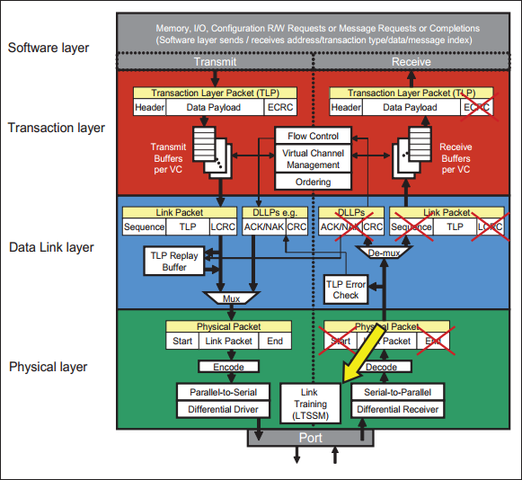
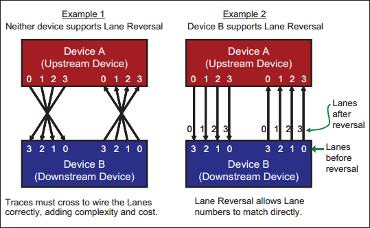
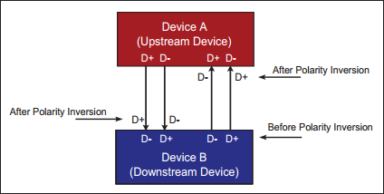

本章描述物理层的链路训练和状态机（Link Training and Status State Machine, LTSSM）：
- 链路的初始化过程是链路从通电或复位到链路达到完全运行的 L0 状态，在此期间发生正常的数据流量。
- 链路电源管理状态 L0s、L1、L2 和 L3 以及状态转换。
- 阐述恢复状态，在此期间的位锁定、符号（Symbol）锁定或块锁定。
- 链路带宽管理的链路速度和位宽变化。

# 1. Overview
链路初始化和训练是由物理层控制的基于硬件（非软件）的过程。该过程配置并初始化设备的链路和端口，以便正常的数据包流量在链路上进行。

Figure 14-1: Link Training and Status State Machine Location

如图 14-1 所示，完整的训练过程在复位后由硬件自动启动，并由 LTSSM（链路训练和状态机）管理。先对以下几个术语进行定义：
- Bit Lock：链路训练开始时，接收端时钟尚未与输入信号的传输时钟同步，无法可靠地对输入位进行采样。在链路训练期间，接收端 CDR（Clock and Data Recovery）逻辑使用传入的比特流作为时钟参考来重新创建发送端的时钟。一旦时钟从流中恢复，接收端就获得了 bit lock，然后能够对输入的位进行采样。
- Symbol Lock：对于 8b/10b 编码，下一步是获取 Symbol Lock。这是一个类似的问题，接收端现在可以识别各个位，但不知道 10 bit Symbol 的边界在哪里。当 TS1 和 TS2 交换时，接收端通过在比特流中搜索可识别的模式来检测。最直接的是 Gen1/Gen2 中的 COM，其是特殊的编码方式，易于识别。
- Block Lock：对于 128b/130b 编码，该过程与 Symbol Lock 略有不同，此时没有 COM 字符。接收端仍然可以通过其他容易识别的标识来找到边界，Gen3 中使用 EIEOOS 来定位，其使用 00h 和 FFh 字节交替模式。它定义了块边界，并且当该模式结束时，下一个 Block 必须结束。
- Link Width：具有多 lane 的设备可以使用不同的链路宽度。例如具有 x2 端口的设备可以与 x4 端口的设备相连。在链路训练期间，两个设备物理层会测试链路宽度并设置为彼此支持的最高值。
- Lane Reversal：多通道设备端口上的通道从通道 0 开始按顺序编号。通常一个设备端口的 lane0 连到对端设备 lane0，lane1 连 lane1，以此类推。然后有时希望能逻辑上反转通道编号以简化布线并允许通道直接接线，不必交叉，如图 14-2。只要一台设备支持可选通道反转功能，该功能就可在两台设备间使用。Spec 不要求支持此功能，因此电路板设计人员需要验证至少一个连接设备支持此功能，然后再以相反的顺序连接通道。

Figure 14-2: Lane Reversal Example (Support Optional)

- Polarity Inversion：两个设备得 D+、D- 差分对也可以根据需要反转，以使电路板布局布线更容易。每个接收端 lane 必须独立检查极性，并在训练期间根据需要自动纠正，如图 14-3 所示。为此，接收端查看传入 TS1/TS2 的符号 6~15，如果在 TS1 中接收到 D21.5 而不是 D10.2，或者在 TS2 中接收到 D26.5 而不是预期的 D5.2，则该通道极性会反转，必须纠正。与 lane 反转不同，极性反转的支持是强制的。

 Figure 14-3: Polarity Inversion Example (Support Required) 

- Link Data Rate：重置后，链路初始化和训练将始终使用默认的 Gen1 速率，以实现向后兼容。如果中间有更高的速率可用，则会在此过程中协商，并且在训练完成后，设备将自动进行快速恢复训练，以更改为支持的最高速率。
- Lane-to-Lane De-skew：走线长度变化和其他因素导致多 lane 链路的并行比特流在不同时间到达接收器，这一问题称为信号偏移（signal skew）。接收端需要根据延迟早期到达的信号来补偿这种把偏差，以对齐比特流（Gen1 允许到达时间有 20 ns 的差异）。这使得电路设计人员摆脱了有时难以创建等长走线的限制。
# 2. Ordered Sets in Link Training
## 2.1 General
## 2.2 TS1 and TS2 Ordered Sets
# 3. Link Training and Status State Machine(LTSSM)
## 3.1 General
## 3.2 Overview of LTSSM States
## 3.3 Introduction, Examples and State/Substates
# 4. Detect State
## 4.1 Introduction
## 4.2 Detailed Detect Substate
### 4.2.1 Detect.Quiet
### 4.2.2 Detect.Active
# 5. Polling State
## 5.1 Introductin
## 5.2 Detailed Polling Substates
### 5.2.1 Polling.Active
### 5.2.2 Polling.Configuration
### 5.2.3 Polling.Compliance
# 6. Configuration State
## 6.1 Configuration State - General
## 6.2 Designing Devices with Links that can be Merged
## 6.3 Configuration State --Training Examples
### 6.3.1 Introduction
### 6.3.2 Link Configuration Example 1
### 6.3.3 Link Configuration Example 2
### 6.3.4 Link Configuration Example 3: Failed Lane
## 6.4 Detailed Configuration Substates
### 6.4.1 Configuration.Linkwidth.Start
### 6.4.2 Configuration.Linkwidth.Accpt
### 6.4.3 Configuration.Lanenum.Wait
### 6.4.4 Configuration.Lanenum.Accept
### 6.4.5 Configuration.Complete
### 6.4.6 Configuration.Idle
# 7. L0 State
## 7.1 Speed Change
## 7.2 Link Width Change
## 7.3 Link Partner Initiated
# 8. Recovery State
## 8.1 Reasons for Entering Recovery State
## 8.2 Initiating the Recovery Process
## 8.3 Detailed Recovery Substates
## 8.4 Speed Change Example
## 8.5 Link Equalization Overview
## 8.6 Detailed Equalization Substates
### 8.6.1 Recovery.Equalization
### 8.6.2 Recovery.Speed
### 8.6.3 Recovery.RcvrCfg
### 8.6.4 Recovery.Idle
## 8.7 L0s State
## 8.8 L1 State
## 8.9 L2 State
## 8.10 Hot Reset State
## 8.11 Disable State
## 8.12 Loopback State
### 8.12.1 Loopback.Entry
### 8.12.2 Loopback.Active
### 8.12.3 Loopback.Exit
# 9. Dynamic Bandwidth Changes
## 9.1 Dynamic Link Speed Changes
## 9.2 Upstream Port Initiates Speed Change
## 9.3 Speed Change Example
## 9.4 Software Control of Speed Changes
## 9.5 Dynamic Link Width Changes
## 9.6 Link Width Change Example
# 10. Related Configuration Registers
## 10.1 Link Capabilities Register.
### 10.1.1 Max Link Speed [3:0]
### 10.1.2 Maximum Link Width[9:4]
## 10.2 Link Capabilities 2 Register
## 10.3 Link Status Register
### 10.3.1 Current Link Speed[3:0]
### 10.3.2 Negotiated Link Width[9:4]
### 10.3.3 Undefined[10]
### 10.3.4 Link Training[11]
## 10.4 Link Control Register
### 10.4.1 Link Disable
### 10.4.2 Retrain Link
### 10.4.3 Extended Synch